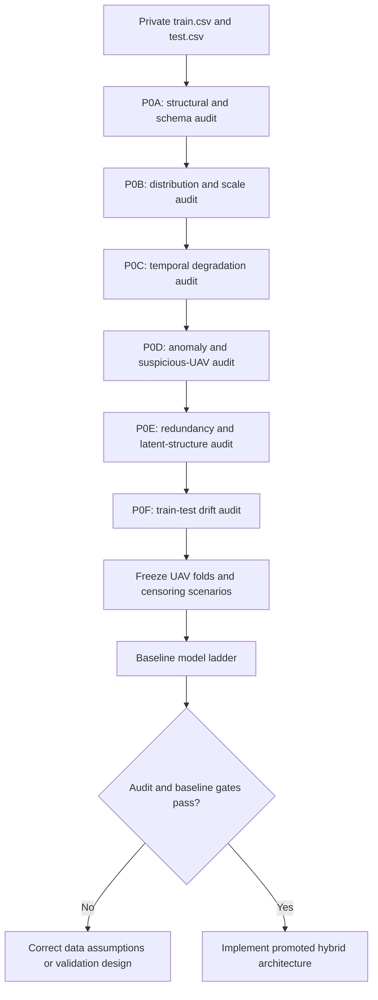
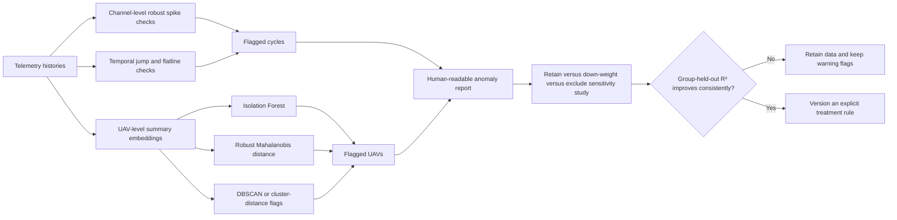
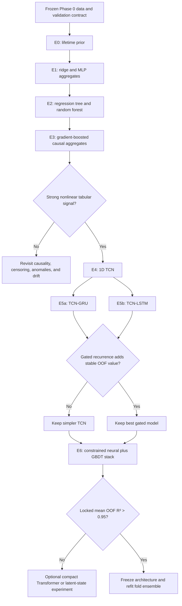

# Phase 0 Audit and Architecture Options

## Purpose

This document turns the exploratory-data-analysis and model-family ideas from the Machine Learning in Mechanics lecture notes into a project-specific implementation plan for the UAV Remaining Useful Life challenge.

It is a companion to the [training and inference architecture](./uav_rul_pipeline_architecture.md). The main architecture defines the target hybrid system; this document defines the analysis gates and experiments that must justify that system before full implementation.

The source lecture examples use small independent datasets, including the 150-sample Iris dataset. UAV telemetry is different: rows are temporally correlated within a UAV, and only 100 training UAVs are statistically independent. Every method below must therefore preserve UAV grouping and causal time order.

## Decisions

1. Phase 0 is a reproducible pipeline stage, not a disposable notebook.
2. Complete UAV histories are the unit of validation and anomaly sensitivity analysis.
3. Raw-row dimensionality reduction is not required: there are only 28 telemetry channels, including two observed constants.
4. PCA, ICA, t-SNE, and UMAP are diagnostic tools or controlled ablations, not default production transforms.
5. Outlier detectors create review flags. They do not automatically delete cycles or UAVs.
6. Scaling, dimensionality reduction, anomaly thresholds, and feature selection are fitted inside training folds whenever they can affect a model or score.
7. Architecture complexity is promoted only by UAV-group-held-out, test-like validation.

## Phase 0 overview



## P0A - Structural and schema audit

### Questions

- Are all required columns present with the expected types?
- Is the actual target column named `RUL`?
- Are `(uav_id, flight_cycle)` keys unique?
- Does every history start at cycle 1, remain consecutive, and stay ordered?
- Are values missing, infinite, duplicated, or malformed?
- Does `RUL + flight_cycle` remain constant within each training UAV?
- Are train and test UAV IDs disjoint?

### Existing local findings

- Training: 24,720 rows and 100 UAVs.
- Test: 16,596 rows and 100 unseen UAVs.
- No missing values, non-finite values, duplicate rows, duplicate keys, cycle gaps, or unordered histories were found in the initial inspection.
- The actual target is `RUL`, despite the challenge summary referring to `target`.
- `RUL + flight_cycle` is exactly constant within every training UAV.

### Outputs

- machine-readable schema report;
- data fingerprint containing hashes, shapes, and column order;
- per-UAV cycle-integrity table;
- hard failure status for training and inference.

## P0B - Distribution and scale audit

The lecture notes propose descriptive statistics, histograms, box plots, quantiles, interquartile ranges, and feature scaling. For this project, calculate them at three levels:

1. all rows;
2. one summary record per UAV; and
3. age bands such as cycles 1-50, 51-100, 101-200, and greater than 200.

### Required analyses

- count, mean, median, standard deviation, min, max, quantiles, and IQR per telemetry channel;
- histograms and robust box plots;
- per-UAV min/max/range and flatline duration;
- scale ratios between channels;
- early-life versus late-life distributions;
- fold-wise stability of each statistic.

### Scaling options

| Method | Advantages | Risks | Use |
|---|---|---|---|
| Standardization | Familiar and suitable for gradient methods | Mean/std are sensitive to outliers and distribution shift | Neural ablation |
| Min-max scaling | Bounded range | Extremely sensitive to outliers and test values outside the training range | Not the default |
| Median/IQR robust scaling | Resistant to spikes and heavy tails | Requires a policy for near-zero IQR | Default neural preprocessing |
| No scaling | Tree models are usually insensitive to monotone scale changes | Unsuitable for neural optimization and distance methods | GBDT branch only |

All fitted scaling parameters belong to a fold-specific model artifact.

## P0C - Temporal degradation audit

Pooled row-level correlations can confuse fleet lifetime, UAV identity, and flight-cycle effects. Analyze degradation at the UAV level as well.

### Required statistics per telemetry channel

- pooled Pearson and Spearman correlation with `RUL`;
- pooled correlation with `flight_cycle`;
- within-UAV Pearson and Spearman correlation with `RUL`;
- distribution of per-UAV linear and robust slopes;
- fraction of UAVs with a consistent trend direction;
- early-to-late effect size;
- last-minus-first value;
- rolling mean, volatility, and slope at windows 5, 20, and 50;
- partial association with `RUL` after controlling for cycle;
- feature usefulness stability across UAV-group folds.

### Interpretation categories

| Category | Meaning | Pipeline treatment |
|---|---|---|
| Strong, stable degradation signal | Similar trend direction across most UAVs | Include in raw sequence and aggregate branches |
| Strong pooled, weak within-UAV signal | Likely UAV or lifetime confounding | Keep as context candidate; do not call it degradation |
| Mostly static within UAV | Operating regime or unit characteristic | Route to early/static context branch |
| High noise, weak stable association | Low expected predictive value | Retain initially, then test with fold-held-out ablation |
| Constant or effectively constant | No usable information | Remove with a fold-fitted variance filter |

The initial audit found `telemetry_20` and `telemetry_27` constant. `telemetry_08` and `telemetry_14` are static for most UAVs and should be tested as context rather than discarded automatically.

## P0D - Anomaly and suspicious-UAV audit

The lecture notes describe Z-score, IQR, Grubbs' test, multivariate Gaussian/Mahalanobis distance, Isolation Forest, One-Class SVM, and DBSCAN. These methods answer different questions and should not be collapsed into one binary outlier label.



### Recommended detector roles

| Detector | Apply to | Priority |
|---|---|---|
| Robust Z-score and IQR | Individual channel spikes, jumps, and extreme levels | Mandatory |
| Grubbs' test | Single suspected univariate outlier under strong assumptions | Low |
| Robust Mahalanobis distance | UAV-level multivariate summaries | Recommended |
| Isolation Forest | Nonlinear UAV-level anomaly ranking | Recommended |
| DBSCAN | Sparse regimes and UAVs outside dense clusters | Diagnostic |
| One-Class SVM | Alternative nonlinear boundary | Lower priority because it is scale/hyperparameter sensitive |

### Suspicious-history checks beyond generic detectors

- long sensor flatlines;
- abrupt permanent level shifts;
- physically implausible single-cycle jumps relative to the same UAV;
- telemetry copied across UAVs;
- unusually short or long lifetimes;
- regime switching;
- prediction residuals concentrated on one UAV;
- train-only or test-only feature ranges.

No observation is removed merely because one detector flags it.

## P0E - Redundancy and latent-structure audit

### Direct redundancy analysis

- Pearson and Spearman feature-correlation matrices;
- clustered correlation heatmap;
- highly correlated feature groups;
- variance inflation or condition diagnostics for linear baselines;
- fold-stable permutation importance from a small tree model;
- masked channel ablations for neural models.

### Dimensionality-reduction options

| Method | Useful question | Recommended role |
|---|---|---|
| PCA | Are a few high-variance directions sufficient? | UAV-level visualization and fold-local ablation |
| Kernel PCA | Is redundancy strongly nonlinear? | Low-priority visualization experiment |
| ICA/FastICA | Are telemetry channels mixtures of independent latent sources? | Diagnostic latent-signal experiment |
| t-SNE | Are local UAV neighborhoods or rare regimes visible? | Visualization only |
| UMAP | Are broader clusters and trajectories visible in a low-dimensional embedding? | Visualization only |
| Autoencoder | Can an unsupervised latent state reconstruct normal histories and expose anomalies? | Later experimental branch |
| Variational autoencoder | Can a smoother probabilistic health-state space be learned? | Research option; high overfitting risk |

### Policy

Do not apply PCA or ICA globally before splitting UAVs. If a reduced representation becomes a model input, fit it on training UAVs only and serialize it with the fold model.

Do not use t-SNE or UMAP coordinates as production features. Their main purpose is to reveal clusters, suspicious UAVs, and train-test support differences.

With only 28 raw telemetry channels, direct dimensionality reduction is not required. It becomes more relevant after causal feature engineering expands the tabular representation into hundreds of correlated aggregates.

## P0F - Train-test drift audit

Test labels remain untouched, but test feature distributions may be inspected for covariate shift.

### Required comparisons

- univariate train/test histograms and quantile differences;
- standardized mean and median shifts;
- range violations;
- missingness and constant-feature differences;
- UAV-level embedding overlap;
- age-distribution differences;
- classifier-based two-sample test using UAV-group-aware validation;
- branch prediction disagreement on test UAVs.

Material drift does not justify fitting preprocessing on test data. It informs robust scaling, validation censoring, error analysis, and uncertainty warnings.

## Missing-value policy

The current CSVs contain no missing values, but the pipeline should define behavior for future or malformed data.

| Situation | Policy |
|---|---|
| Missing identifier or cycle | Hard failure |
| Missing entire telemetry channel | Schema failure unless an explicitly versioned model supports it |
| Isolated missing value in a history | Fold-fitted median or causal interpolation plus a missingness indicator |
| Consecutive missing telemetry interval | Flag the UAV and use an explicitly tested policy |
| Interpolation requiring future cycles beyond cutoff | Forbidden because it leaks future information |
| KNN or MICE imputation | Optional tabular ablation fitted inside folds; not the default for sequences |

## Architecture options from the lecture material

| Model family | Project use | Strength | Main risk | Priority |
|---|---|---|---|---|
| Linear/ridge regression | Causal aggregate sanity baseline | Transparent and fast | Underfits nonlinear degradation | Required baseline |
| MLP | Nonlinear aggregate baseline | Simple neural comparison | Ignores explicit temporal structure | Required baseline |
| Regression tree | Interpretable nonlinear baseline | Shows useful thresholds | High variance | Required baseline |
| Bagging/random forest | Robust tree ensemble | Handles interactions and offers importance | Correlated features can correlate trees | Recommended comparison |
| Gradient boosting/XGBoost | Main tabular branch | Strong on nonlinear engineered features | Can overfit row-level leakage | Primary branch |
| 1D CNN/TCN | Local temporal branch | Learns trends, jumps, and multi-scale patterns | Limited memory without dilation/depth | Primary component |
| GRU | Compact sequence memory | Fewer parameters than LSTM | Sequential training and possible gradient issues | Primary component |
| LSTM | Alternative gated sequence model | Stronger explicit memory cell | More parameters with only 100 UAVs | High-priority ablation |
| Deep/bidirectional RNN | Larger observed-prefix encoder | More representational capacity | Higher overfitting and audit complexity | Experimental |
| Transformer encoder | Long-range attention | Flexible interactions and parallel training | Data hungry; positional design matters | Optional compact branch |
| Autoencoder anomaly model | Unsupervised health representation | Can expose reconstruction anomalies | May reconstruct noise and regimes | Later experiment |
| Neural ODE | Continuous latent degradation path | Elegant trajectory model | Unnecessary complexity for regular cycles | Research option |
| DeepONet/neural operator | Operator-learning formulation | Useful for function-to-function physics problems | No clear operator or physical semantics here | Not recommended now |

## Architecture selection flow



## Recommended target architecture

The current recommendation remains:

```text
causal raw sequence
  -> fold-specific robust scaling
  -> residual dilated 1D TCN
  -> compact GRU
  -> masked attention pooling
  -> direct-RUL and terminal-life heads

causal full-prefix aggregates
  -> gradient-boosted regression trees

observed age plus fold training lifetimes
  -> low-weight conditional lifetime prior

inner OOF predictions
  -> non-negative constrained stacker
```

The LSTM replaces the GRU only if nested group-held-out validation justifies its additional parameters. A compact Transformer is considered only after the TCN-GRU and GBDT hybrid has been evaluated; it is not the starting architecture.

## Experiment roadmap

| Stage | Deliverable | Exit condition |
|---|---|---|
| P0A | Structural audit report | All hard data-contract checks pass |
| P0B | Distribution and scaling report | Scaling policy and fold-fitted variance rules are fixed |
| P0C | Degradation feature report | Stable, confounded, static, and noisy channels are distinguished |
| P0D | Anomaly report | Suspicious cycles/UAVs are flagged and sensitivity-tested |
| P0E | Redundancy and latent report | Dimensionality-reduction policy and diagnostic plots are complete |
| P0F | Drift report | Material train-test differences are documented |
| V0 | Frozen fold/censoring manifest | No UAV leakage and locked scenarios are reproducible |
| E0-E3 | Classical baselines | Nonlinear tabular branch is established or data assumptions are revisited |
| E4-E5 | Temporal models | Best compact causal sequence encoder is selected |
| E6 | Hybrid stack | Mean locked test-like OOF R² exceeds 0.95 with guardrails |
| F0 | Final fold ensemble | Reproducible model bundle and valid submission are produced |

## Phase 0 artifacts

```text
reports/phase_0/
  schema_and_integrity.md
  distributions_and_scaling.md
  temporal_degradation.md
  anomaly_review.md
  redundancy_and_latent_structure.md
  train_test_drift.md
  figures/
artifacts/phase_0/
  data_manifest.json
  uav_summary.parquet
  anomaly_flags.parquet
  feature_audit.parquet
  fold_manifest.json
  censoring_scenarios.json
```

Raw competition data, row-level derived extracts, anomaly flags, and model artifacts must remain ignored or stored only in an explicitly private location permitted by the competition rules.

## Phase 0 completion gate

Phase 0 is complete only when:

1. structural checks are automated and passing;
2. scaling and low-variance policies are frozen;
3. every telemetry channel has a documented temporal-signal classification;
4. suspicious UAVs have been reviewed through sensitivity experiments;
5. PCA/ICA/clustering results are interpreted as diagnostics rather than assumed improvements;
6. train-test drift is quantified;
7. UAV-group folds and censoring scenarios are frozen; and
8. the baseline training code consumes the same versioned audit artifacts that final training will use.
