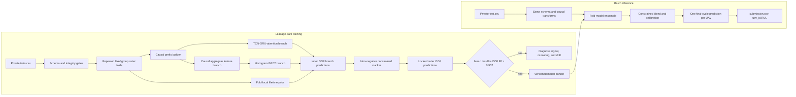
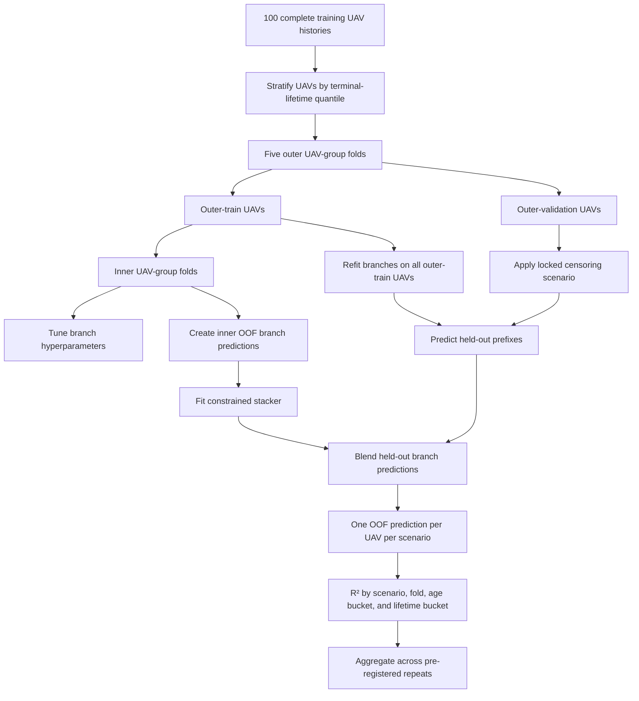
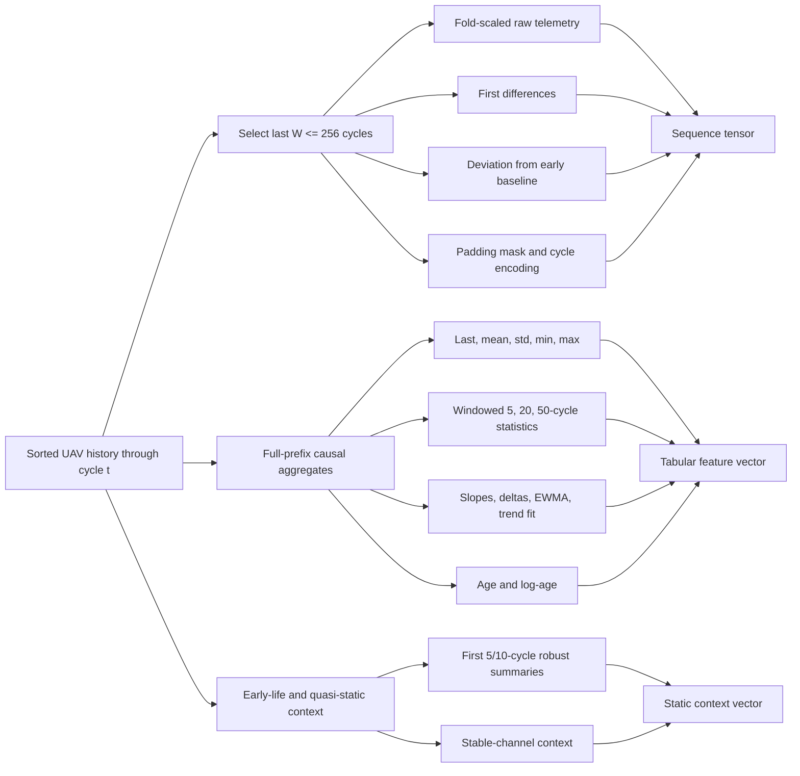
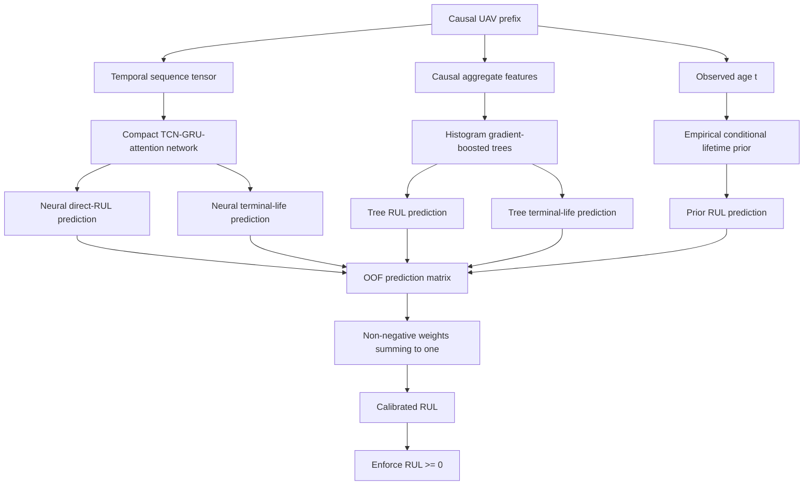
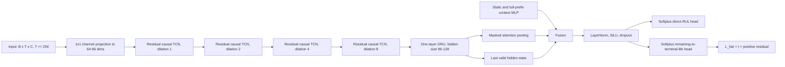
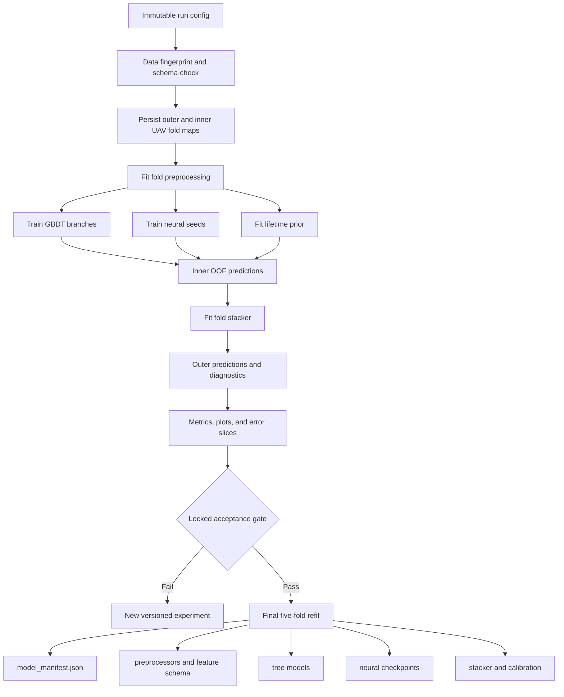
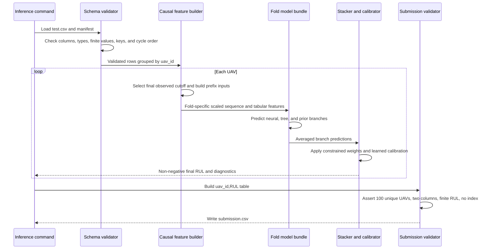

# UAV Remaining Useful Life - Training and Inference Architecture

## Status and decision

This document defines a competition-oriented, offline training and batch-inference architecture for the UAV Remaining Useful Life challenge. It is based on the local `train.csv` and `test.csv` files plus the [challenge brief](./uav_remaining_useful_life_challenge.md).

The recommended system is a leakage-safe hybrid:

1. a causal TCN-GRU-attention network for temporal degradation patterns;
2. a histogram gradient-boosted tree model for causal summary features;
3. a small empirical lifetime prior for shrinkage in weak-signal cases; and
4. a constrained out-of-fold stacker.

The goal `R² > 0.95` is an acceptance gate, not a guaranteed leaderboard result. It is considered achieved only when the locked, group-held-out, test-like validation protocol in this document reports a mean out-of-fold R² above 0.95.

## Evidence from the local data

| Property | Observation | Architectural consequence |
|---|---:|---|
| Training data | 24,720 rows, 100 UAVs | The effective independent sample size is 100 UAVs, not 24,720 rows. Keep the neural model compact. |
| Test data | 16,596 rows, 100 unseen UAVs | Validation must hold out complete UAVs. |
| Train history length | 145-525 cycles; median 220.5 | Use bounded sequence windows plus full-history summaries. |
| Test observed length | 38-475 cycles; median 148 | Simulate censoring during validation and training. |
| Target schema | The actual target column is `RUL`, not `target` | Treat the CSV schema as authoritative and fail fast on drift. |
| Target construction | `RUL + flight_cycle` is exactly constant within each training UAV | Reframe the task as terminal-lifetime estimation with a direct-RUL consistency head. |
| Target range | 0-524, integer-valued | Use a non-negative output and evaluate extrapolation at long lifetimes. |
| Data integrity | No missing/non-finite values, duplicate rows, duplicate keys, cycle gaps, or unordered histories | Keep validation gates anyway; inference must reject malformed input. |
| Constant channels | `telemetry_20` and `telemetry_27` | Remove them fold-locally with a variance filter. |
| Mostly static channels | `telemetry_08` and `telemetry_14` are static for most UAVs | Route stable early-life summaries to the context branch instead of relying on temporal convolutions. |
| Distribution shift | Several telemetry channels show material train-test shifts | Fit preprocessing per fold, monitor drift, and avoid brittle global thresholds. |

A diagnostic causal ridge model using 266 current/rolling prefix features reached only about 0.50 all-prefix OOF R². The fold-local unconditional lifetime prior reached about 0.28. These are diagnostics, not candidate final models: they show that nonlinear degradation regimes must be learned and that the prior cannot carry the solution.

The downloaded competition directory is excluded by `.gitignore`. Raw competition data and derived row-level extracts must remain local and subject to the competition rules.

## System overview



## Problem formulation

For UAV `i` at observed flight cycle `t`, define the terminal lifetime:

```text
L_i = t + RUL_i,t
```

The equality is exact throughout every training history. The model therefore receives only the prefix `x_i,1:t` and learns two consistent quantities:

```text
direct remaining life:      r_hat_i,t >= 0
estimated terminal life:    L_hat_i,t >= t
consistency requirement:    r_hat_i,t ~= L_hat_i,t - t
```

Predicting both targets exposes failure modes. A model can fit degradation state but misestimate fleet lifetime, or fit a lifetime prior while ignoring recent degradation. The consistency penalty and the stacker can use both estimates.

`uav_id` is a grouping key only. Its numeric suffix must never be a feature.

## Data contracts and leakage barriers

Every training example is a cutoff `(uav_id, t)`. Its features may use rows with `flight_cycle <= t` only. Labels may use the provided `RUL` value at `t`; features may not use the known final cycle or any future telemetry.

| Risk | Required barrier |
|---|---|
| Rows from one UAV appear in train and validation | Split UAV IDs before creating scalers, features, examples, priors, or models. |
| Full lifetime leaks into a prefix feature | Keep `max(flight_cycle)`, row count, final-cycle telemetry, and `RUL` out of the feature builder. |
| Global scaling leaks held-out UAV statistics | Fit variance filters, imputers, robust scalers, feature selection, and clipping limits on the training portion of each fold. |
| Long-lived UAVs dominate training | Sample equal numbers of cutoffs per UAV per epoch or assign inverse-history-length weights. |
| Validation uses only end-of-life rows | Generate locked test-like censoring scenarios from held-out histories. |
| Stacker sees predictions from models trained on the same UAV | Fit stacker weights on inner OOF branch predictions only. |
| Lifetime prior uses held-out lifetimes | Recompute the prior from the training UAVs of every fold. |
| Test distribution drives repeated tuning | Pre-register censoring seeds and keep a locked outer gate. |

## Validation architecture and success contract

The public leaderboard is not the development metric. Approximately 30% of the test set contributes to the public score, so it is too noisy for architecture selection.



### Locked censoring protocol

1. Use five outer folds, with complete UAV separation and approximate balance by terminal-lifetime quintile.
2. Define 20 fixed censoring scenarios before model selection.
3. In each scenario, choose one cutoff age for every held-out UAV from the observed test-age distribution, conditioned on the training UAV still being alive at that age.
4. Join predictions from all five outer folds to obtain exactly 100 OOF predictions per scenario.
5. Compute R² over those 100 predictions. Do not average fold-level R² values because small fold denominators make them unstable.
6. Use different, unlocked scenarios inside the inner folds for tuning. Never tune on the locked outer scenarios.

### Acceptance gate

The architecture passes only if all of the following hold:

- mean R² across the 20 locked scenarios is greater than 0.95;
- the 95% bootstrap lower confidence bound across UAVs and scenarios is at least 0.92;
- no material age or terminal-lifetime bucket collapses below 0.85;
- predictions are reproducible from a clean environment and fixed seeds;
- schema, leakage, and submission tests all pass.

If local R² exceeds 0.95 while the leaderboard remains near 0.90, treat that as evidence of censoring mismatch, distribution shift, or leakage. Do not respond by tuning directly to the public leaderboard.

## Causal example and feature generation

Training should not materialize every possible long sequence on disk. Store sorted UAV histories once and sample cutoff/window pairs in the data loader.



### Sampling policy

- Sample a fixed number of cutoffs per UAV per epoch so a 525-cycle UAV does not receive 3.6 times the weight of a 145-cycle UAV.
- Draw 60% of cutoffs from the empirical test-age distribution, conditioned on survival.
- Draw 20% uniformly across each UAV's valid lifetime to retain broad coverage.
- Draw 20% from late-life cycles to retain failure-state resolution.
- For the temporal-consistency loss, occasionally sample two ordered cutoffs from the same UAV.
- Regenerate cutoff samples each epoch, but keep validation cutoffs fixed.

### Preprocessing

- Sort by `uav_id, flight_cycle` and assert consecutive cycles beginning at 1.
- Drop fold-constant channels. The current data makes `telemetry_20` and `telemetry_27` obvious candidates, but the code must decide from fold statistics.
- Use median/IQR or another robust scaler fitted on outer/inner training UAVs only.
- Preserve near-static signals in the context branch; do not automatically discard them solely because they have little within-UAV variation.
- Add a padding mask. Padding values must not contribute to convolutions, recurrence, or attention pooling.
- Save the ordered schema and all preprocessing parameters with every fold model.

## Hybrid model



### Branch A: compact temporal network

The default network is intentionally small enough for an 8 GB GeForce RTX 3070.



Recommended starting configuration:

| Component | Starting value | Search range |
|---|---:|---:|
| Maximum sequence length | 256 | 128, 192, 256 |
| TCN width | 96 | 64-128 |
| TCN kernel | 5 | 3, 5, 7 |
| Dilations | 1, 2, 4, 8 | optionally add 16 |
| GRU layers | 1 | 1-2 |
| GRU hidden size | 112 | 64-160 |
| Fusion width | 128 | 96-192 |
| Dropout | 0.15 | 0.05-0.30 |
| Parameter budget | less than 1.5 million | hard cap at 3 million |
| Batch size | 64 with AMP | 32-128 |

Use unidirectional recurrence by default. A bidirectional GRU over the observed prefix does not technically see post-cutoff data, but the causal version is easier to audit and can later support online inference.

### Neural objective

Optimize stable regression losses, not minibatch R²:

```text
loss = Huber(r_hat, RUL)
     + 0.5 * Huber(L_hat, flight_cycle + RUL)
     + lambda_consistency * Huber(r_hat, L_hat - flight_cycle)
     + lambda_temporal * temporal_consistency_loss
```

For two prefixes of the same UAV at `t1 < t2`, the temporal term penalizes deviation from:

```text
r_hat(t1) - r_hat(t2) = t2 - t1
```

Start with `lambda_consistency = 0.2` and `lambda_temporal = 0.05`, then tune inside group-held-out inner folds. Standardize regression targets using training-fold statistics before applying Huber loss, and invert the transform for R².

Train with AdamW, mixed precision, gradient clipping, early stopping on inner test-like OOF R², and a cosine or one-cycle learning-rate schedule. A practical initial search is learning rate `3e-4` to `2e-3`, weight decay `1e-6` to `1e-3`, and clipping norm `0.5` to `2.0`.

### Branch B: histogram gradient-boosted trees

Use a strong histogram GBDT implementation such as LightGBM, XGBoost, or CatBoost. The input is the causal tabular vector, never a flattened padded sequence.

Train two regressors:

- direct `RUL`; and
- terminal lifetime `flight_cycle + RUL`, converted back to RUL at prediction time.

Search depth/leaves, minimum samples per leaf, learning rate, number of trees, row sampling, column sampling, and L1/L2 regularization in inner group folds. Early stopping must use validation UAVs, not randomly held-out rows.

The nonlinear tree baseline is a stop/go gate. If causal aggregate GBDT performance is poor, debug feature causality, censoring, and distribution shift before spending time on a larger neural model.

### Branch C: empirical lifetime prior

For each training UAV, compute its observed terminal lifetime `L_i`. At age `t`, the simplest fold-local prior is:

```text
prior_RUL(t) = mean(L_i - t | L_i >= t)
```

An optional refinement clusters UAVs using early-life/stable context and shrinks each cluster's conditional prior toward the global prior. With only 80 UAVs in an outer-training fold, keep this model low-dimensional and strongly regularized.

The prior scored poorly alone in the diagnostic study. Cap its ensemble weight at 0.15 unless nested OOF evidence clearly justifies more. Its role is graceful fallback and variance reduction, not primary prediction.

### Constrained stacking

Fit a linear stacker on branch predictions with weights constrained to be non-negative and sum to one. Include an intercept only if nested OOF results justify it. This prevents a 100-UAV meta-model from learning unstable cancellation weights.

Do not introduce age-dependent gating until a static blend has passed the locked protocol. If age-dependent blending is later attempted, use only a few predeclared age bins and fit them entirely inside nested CV.

## Training orchestration and artifacts



Every run should record:

- source revision and dirty-worktree state;
- raw file hashes, shapes, and schema without copying raw data;
- fold and censoring-scenario assignments;
- random seeds and deterministic-mode settings;
- preprocessing and feature-schema versions;
- branch and blended OOF predictions;
- R² overall and by age/lifetime buckets;
- training curves, early-stopping points, runtime, and peak VRAM;
- serialized models and a manifest connecting every artifact.

Use the local RTX 3070 for single-fold development. Use Kaggle/cloud GPUs for repeated folds and bounded hyperparameter searches. Never use the test leaderboard as the hyperparameter optimizer.

## Experiment ladder

Run experiments in this order and retain OOF predictions from every stage:

| Stage | Model | Purpose |
|---|---|---|
| E0 | Conditional lifetime prior | Validate splits, censoring, and metric code. |
| E1 | Causal ridge | Validate causal aggregate generation and scaling. |
| E2 | Current-row histogram GBDT | Establish nonlinear telemetry signal. |
| E3 | Full causal aggregate GBDT | Measure the value of trends and history. |
| E4 | TCN plus context MLP | Establish a compact neural baseline. |
| E5 | TCN-GRU-attention with dual heads | Add multi-scale sequence memory and consistency. |
| E6 | Neural seed ensemble | Reduce variance without changing the architecture. |
| E7 | Constrained hybrid stack | Attempt the locked R² > 0.95 gate. |

Promote complexity only when it improves inner group-held-out test-like R² and at least one weak performance slice without materially damaging another.

## Final fitting strategy

After the architecture and hyperparameters are frozen:

1. Retain the five outer-style folds as final ensemble folds.
2. Train one GBDT pair and two or three neural seeds per fold.
3. Generate global OOF branch predictions and fit the final constrained stacker from them.
4. For each test UAV, obtain predictions from every fold model.
5. Average predictions within each branch, then apply the OOF-fitted stacker and calibration.
6. Save both the final prediction and branch disagreement for diagnostics.

Fold ensembling is preferred to a single all-data model because it preserves proven preprocessing/model pairings and reduces variance on only 100 independent training UAVs.

## Inference sequence



Inference must be deterministic, batch-oriented, and idempotent. Re-running the same model bundle on byte-identical input must produce byte-identical output within the chosen numeric precision.

## Inference safeguards

- Require exactly the expected identifier, cycle, and telemetry columns. The train-only `RUL` column must be absent from test input.
- Reject duplicate `(uav_id, flight_cycle)` keys, gaps, unordered cycles, missing values, and non-finite telemetry.
- Use only the final available cycle of each test UAV for the submission, while feeding its preceding history to the models.
- Apply `RUL >= 0`. Do not impose an arbitrary upper clip; learn any calibration or cap from nested OOF predictions.
- Compare branch disagreement and input drift with training-fold ranges. Large disagreement should create a warning artifact, not silently change the prediction.
- Write exactly `uav_id,RUL` with no index and one row per test UAV.

## Failure analysis

When a run fails, slice residuals by:

- observed age and terminal lifetime;
- short, medium, and long prefix lengths;
- degradation rate derived from the most target-correlated channels;
- stable-channel regimes;
- train-test drift severity;
- neural/tree disagreement; and
- underprediction versus overprediction.

Use permutation importance or SHAP on the tree branch and masked channel/window ablations on the neural branch. Interpretability is primarily a leakage and drift diagnostic here because the telemetry channels are anonymized.

## Proposed implementation map

```text
configs/
  baseline.yaml
  hybrid_tcn_gru.yaml
src/uav_rul/
  data/schema.py
  data/prefix_dataset.py
  features/causal_aggregates.py
  validation/folds.py
  validation/censoring.py
  models/temporal.py
  models/gbdt.py
  models/lifetime_prior.py
  models/stacker.py
  train.py
  infer.py
  submission.py
tests/
  test_schema.py
  test_feature_causality.py
  test_group_leakage.py
  test_inference_parity.py
  test_submission.py
artifacts/
  <run_id>/model_manifest.json
```

`artifacts/`, raw data, checkpoints, OOF row-level predictions, and submissions should be ignored unless the repository is explicitly configured as private and the competition rules permit their storage.

## Definition of done

The pipeline architecture is implemented successfully when:

1. a unit test proves that changing rows after cutoff `t` cannot change features or predictions at `t`;
2. all preprocessing and model fitting occurs inside UAV-group folds;
3. the locked validation protocol produces reproducible scenario-level results;
4. the hybrid mean OOF R² exceeds 0.95 and all acceptance guardrails pass;
5. final inference uses only versioned artifacts and the final observed test prefix;
6. the generated submission passes schema, count, uniqueness, and finite-value checks; and
7. a clean run can reproduce the model bundle and submission from configuration plus local private data.

Until item 4 is observed, describe the system as an architecture targeting R² > 0.95, not one that has achieved it.
