# Phase 0: Data Analysis

Based on Lecture Notes:

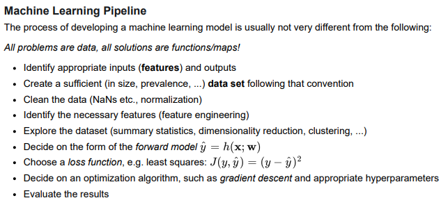

This file talks about the bullet points 1 to 5. Bullet point to is ignored as the dataset already exists.

## Objective

Complete a reproducible data and validation audit before model development begins.

## Broad Data Review

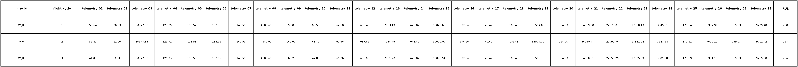

The input data (train.csv) consists of 31 columns, the uav_id, the flight cycle of the UAV, 28 telemetry values and the RUL. These telemetry values need to be analyzed to what extent they correlate with the RUL. The training is therefore based on these values and the training cycle number but before that unnecessary telemetry data should be removed from the dataset.

The test dataset obviously does not have the RUL column.

The output data on the other hand, so the value the model should predict is simply a scalar value representing the RUL (Remaining Useful Lifetime).

## Statistical Review

### Cycle-wise fleet-level telemetry trend analysis
To find out which telemetry data is useful for us we can plot each telemetry column over its flight cycle number and check how they evolve.

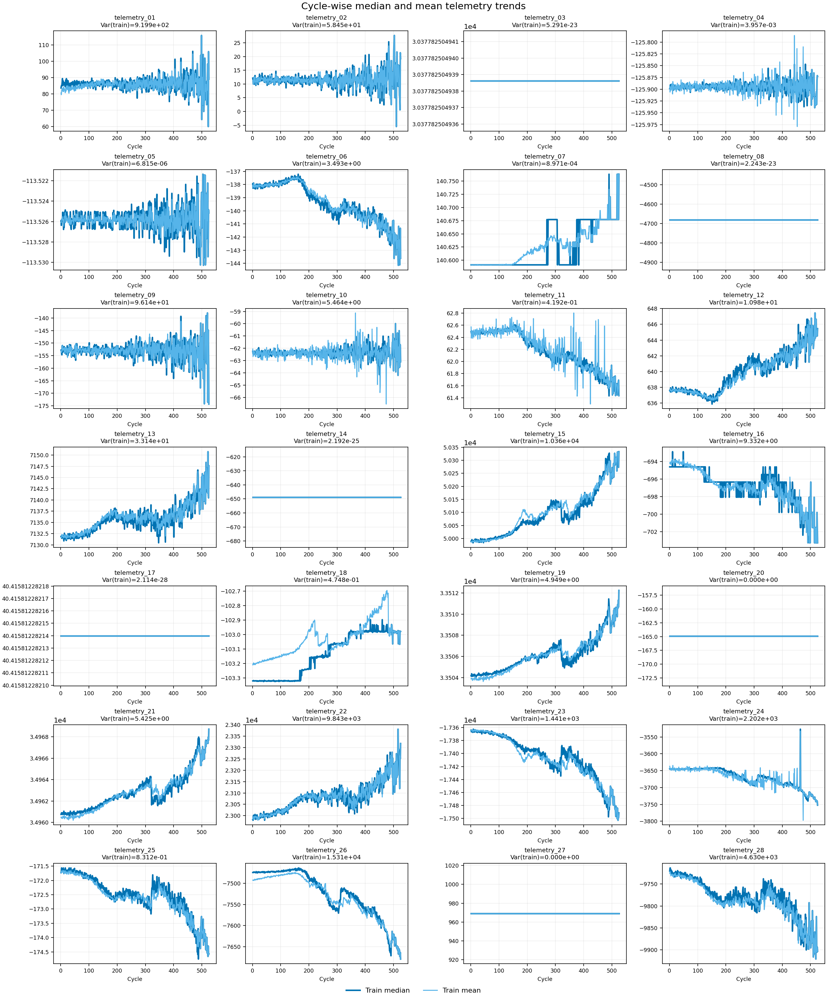

This plot shows the median (blue) and the average value of each telemetry channel (light blue) over the number of flight cycles.
Here we can see that telemetry_03, telemetry_08, telemetry_14, telemetry_17, telemetry_20 and telemetry_27 stay constant over all UAVs and cycles. Therefore these channels are likely to be not useful for training the model.
But important to note is that at the end there are only a limited number of UAVs "surviving" (or data points available), therefore we have a survivor bias here.

**Findings:**
- Channels 03, 08, 14, 17, 20, 27 likely irrelevant

### Descriptive statistics

Count, mean, median, standard deviation, minimum, maximum, quantiles, and IQR show the scale, skewness, spread, and extreme values of each telemetry channel. These results support scaling, transformation, and anomaly-review decisions.

In other words, here we see how much the data points vary in general for each telemetry channel.

- Gray line and × marks: complete minimum-to-maximum range
- Light blue line: central 90% of values, from P05 to P95
- Dark blue line: IQR—the middle 50%, from P25 to P75
- White vertical mark: median
- Black diamond: mean
- Text: observation count, standard deviation, and IQR (Interquartile Range, measures the spread of the middle 50% of the data)

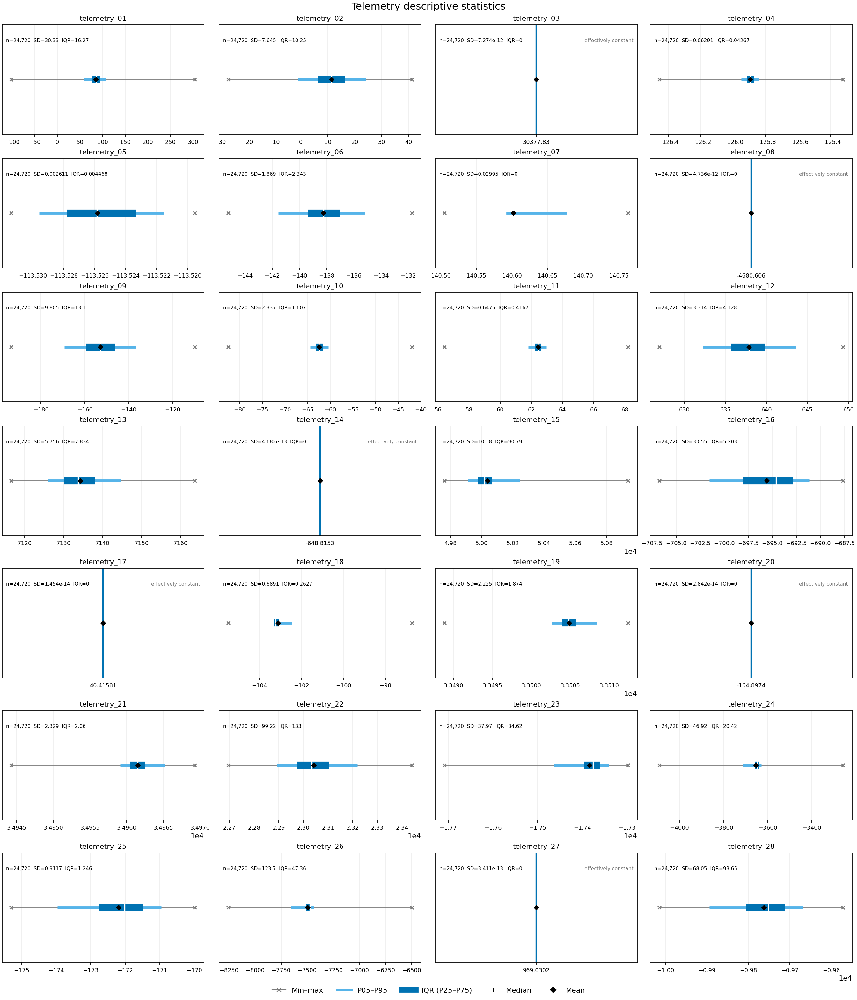

**Findings:**
- Again we can see that telemetry_03, 08, 14, 17, 20, and 27 are effectively constant. Therefore they dont really provide useful variation and are removal candidates.
- Channel scales differ enormously. For example, some values are near 10 while others are near 50,000. **Standardization or robust scaling** is therefore highly advisable here.
- telemetry_01, 04, 10, 11, 18, 24, and 26 have min–max ranges much wider than their central distributions. This indicates rare extreme readings, outliers, or distinct operating regimes that should be investigated (see subchapter *Tukey's Range Test*)
- Separation between the mean and median indicates asymmetry. The largest differences occur in channels such as telemetry_07, 16, 23, 18, and 25, although the overall skew is moderate. Use **Yeo–Johnson transformation** for linear or neural models. We need to proof if these channels actually correlate with RUL -> **Turn channel on or off and check if validation results improve**
- A large SD relative to the IQR indicates that extreme values influence the standard deviation. **Robust scaling** (yes, thats the name) may therefore be safer than ordinary mean/SD scaling for some channels. Do not use this scaling for tree-based models (Random Forest, XGBoost, ...)

#### Tukey's Range Test

To investigate the unusually wide min–max ranges, extreme-value boundaries are calculated from the training data as:

$$
\mathrm{lower\ bound} = Q_1 - 3 \times \mathrm{IQR}
$$

$$
\mathrm{upper\ bound} = Q_3 + 3 \times \mathrm{IQR}
$$

The training-derived boundaries are then applied unchanged to both the training and test datasets. Red points are training extremes, orange points are test extremes, and the dashed lines show the lower and upper boundaries. Looking at the extreme readings over flight cycle helps distinguish isolated sensor spikes from sustained UAV-specific operating regimes.

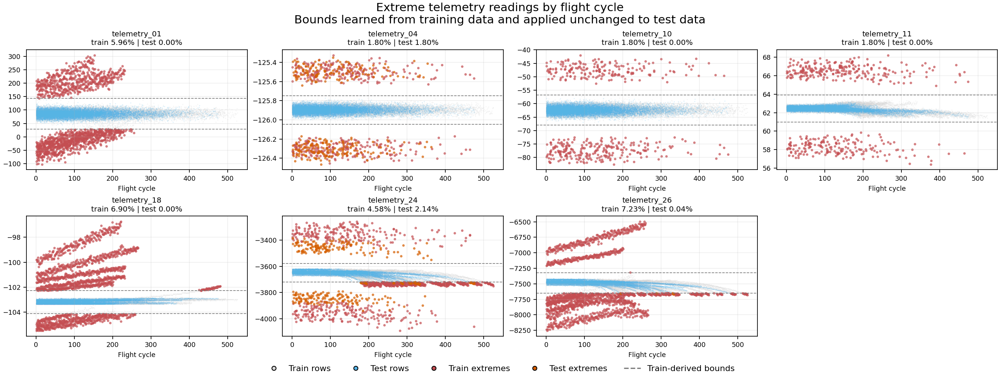

**Findings:**

- For `telemetry_04`, `telemetry_10`, and `telemetry_11`, approximately 97% of the training extremes are isolated readings. This pattern is more consistent with recurring single-cycle spikes than with sustained degradation. -> **Use individual and synchronized-event flags: Flagging them for the model could improve generalization (check if this actually improves the results)**
- The extremes in `telemetry_01` and `telemetry_18` form long consecutive runs but are concentrated in only 8–9 training UAVs. They are therefore more likely to represent UAV-specific operating regimes or calibration differences.
-> **Use regime flags: Flagging them for the model could improve generalization (check if this actually improves the results)**
- `telemetry_26` also contains mostly sustained extremes and affects 48 training UAVs. -> **Use regime flag: Flagging them for the model could improve generalization (check if this actually improves the results)**
- `telemetry_24` shows mixed behavior and contains extremes in both training and test data. Removing or clipping all of these values would therefore be risky. -> **Don't flag for now but could potentially be flagged as low- and high-extreme flags (check too)**
- Extreme values should not be removed automatically. Any clipping boundaries must be learned from the training portion of each validation fold to avoid **data leakage**.

### Row-level statistics

The plot describes the shape of each telemetry distribution across all recorded cycles.

- Left panel - (mean - median) / SD:
    - Near zero: roughly symmetric distribution.
    - Positive: unusually high values pull the mean upward.
    - Negative: unusually low values pull the mean downward.
    - Larger magnitude means stronger asymmetry.

- Right panel - IQR / SD:
    - Low value: extreme readings or multiple regimes inflate the SD.
    - Around 1.35: approximately normal-shaped distribution.
    - High value: more concentrated, bounded, or discrete distribution.
    - Zero: effectively constant channel.

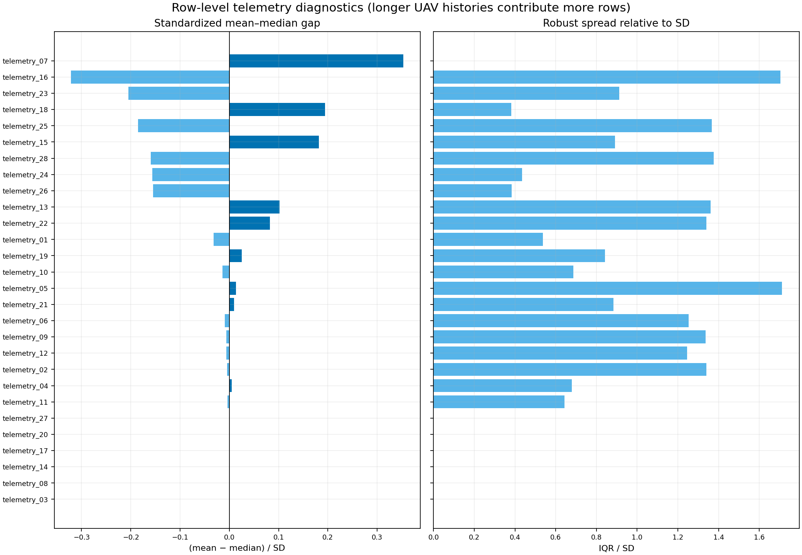

**Findings:**
- Several channels are asymmetric or affected by extreme values, especially telemetry_07, 16, 18, 23, and 25. -> **Robust scaling** 
- Channels such as 18, 24, and 26 have particularly low IQR-to-SD ratios and deserve **anomaly or operating-regime review**.

### UAV-level statistics

The UAV-level analysis first averages each telemetry channel within a UAV and then compares the 100 UAV summaries. This gives every training UAV equal weight and reveals whether variation is associated with UAV identity.

- Light-blue dot: one UAV’s mean telemetry value
- Box: middle 50% of UAV means
- Line inside the box: median UAV
- Whiskers: typical range
- Black diamond: mean across the 100 UAVs
- Isolated dots: UAVs whose average differs substantially from the fleet

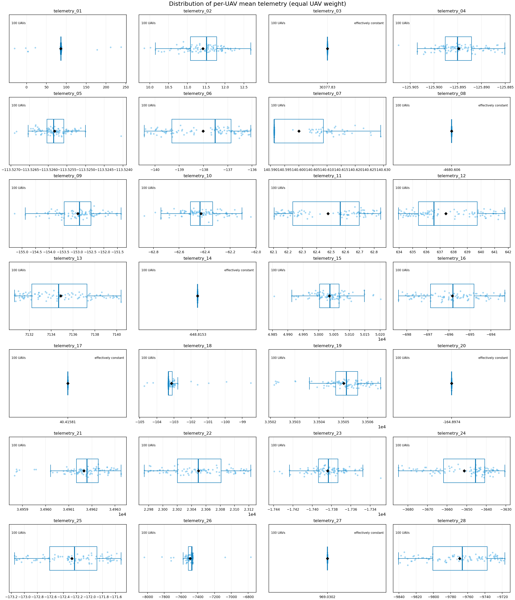

This plot tells us about the following things:
- Between-UAV variation: A wide distribution means UAVs operate at different average levels -> **Potential context feature**
- Typical fleet value: The median and box describe a representative (median)UAV.
- Skewness: Separation between the mean and median indicates an asymmetric distribution.
- Operating regimes: Separate groups of dots can reveal distinct configurations or conditions.
- Unusual UAVs: Isolated dots identify UAVs requiring investigation.
Constant features: A collapsed box and overlapping dots indicate no useful UAV-level variation.
- Context candidates: Channels that vary strongly between UAVs but little within them may represent operating context or UAV identity.

**Findings:**
- telemetry_03, 08, 14, 17, 20, and 27 are effectively constant across UAVs. -> **Again, removal condidates**
- Channels such as telemetry_01, 06, 12, 18, and 26 show substantial UAV-to-UAV differences. They may represent operating conditions, configuration, or UAV identity rather than degradation alone. -> **Potential context or baseline features, might use Yeo–Johnson transformation and/or robust scaling**
- Distinct groups or isolated UAVs may indicate operating regimes or anomalies. -> **Flagging**
- Narrow boxes suggest UAVs have similar average values; wide boxes indicate stronger between-UAV variation. -> **Seperation of baseline values and deviation value (potential degradation information)**

### Age-band statistics

Telemetry statistics are compared across cycles 1–50, 51–100, 101–200, and over 200. Changes between these bands help distinguish degradation-related signals from operating-context signals.

- Dark-blue line: median telemetry value.
- Light-blue line: mean telemetry value.
- Shaded region: IQR—the middle 50% of readings.
- n below each band: number of contributing rows.
- Each subplot has its own vertical scale.

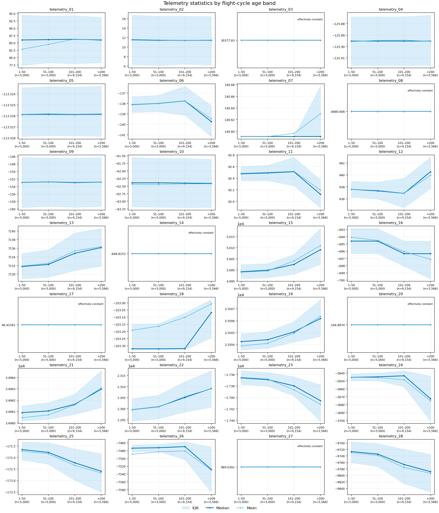

**Findings:**
- Potential age-linked degradation indicators: telemetry_06, 11, 12, 13, 15, 16, 19, 21, 22, 23, 24, 25, 26, and 28.
    - Increasing with age: telemetry_12, 13, 15, 19, 21, and 22.
    - Decreasing with age: telemetry_06, 11, 16, 23, 24, 25, 26, and 28.
- Age-stable channels: telemetry_01, 02, 04, 05, 09, and 10. Effectively constant channels are telemetry_03, 08, 14, 17, 20, and 27.
- Noticeable mean–median separation: telemetry_07, 15, 16, 18, 19, 21, and 23, suggesting skewness or multiple operating regimes. -> **Baseline seperation valuable**
- Clearly widening IQR at later ages: telemetry_06, 07, 11, 12, 15, 16, 19, 21, 22, 23, 24, 25, 26, and 28, suggesting increasing variability or survivor/fleet-composition effects.

-> **Especially the age-linked indicators might be the most important channels**

### History-length distributions

Train and test history-length distributions show how much information is available at prediction time. The difference between the two distributions should guide the selection of test-like validation cutoffs. So it tells us how we must construct validation and training examples. The central point is that the **model must learn to predict from incomplete histories**, not only from complete run-to-failure sequences.

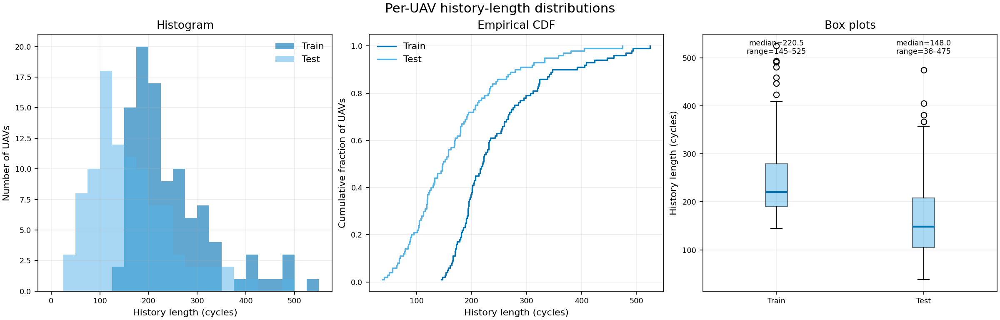

**Findings:**
**Findings directly supported by the history-length diagram:**

- **Histogram and ECDF:** Test histories are generally shorter than training histories, so training and validation samples should use partial UAV prefixes.
- **ECDF at 145 cycles:** Approximately 47% of test UAVs stop before the shortest complete training lifetime; therefore, validation must emphasize cutoffs between cycles 38 and 144.
- **Test histogram and ECDF:** Sample cutoff lengths from the observed test distribution rather than uniformly across all cycles.
- **Box plots:** Train histories span 145–525 cycles, while test histories span 38–475; therefore, the model must handle variable-length inputs.
- **Sparse histogram right tail and box-plot outliers:** Few UAVs have very long histories, so validation results at long cutoffs are less reliable.
- **Different history lengths across UAVs:** Give every UAV equal total weight so long histories do not dominate training.
- **Full history-length range:** Report performance by cutoff band, such as cycles 1–50, 51–100, 101–200, and over 200.

-> **Findings are here about the design of the training and validation datasets, not which channels to use or how to handle them**

**General training and validation rules—not read directly from the diagram:**

- Split by `uav_id`; all prefixes from one UAV must remain in the same fold.
- Use five fixed folds as a design choice, giving approximately 20 validation UAVs per fold.
- Use a fixed number of training cutoffs per UAV; 20 is a configurable starting point.
- Use 20 fixed test-like validation scenarios as a configurable robustness check.
- Build features using only cycles available up to the selected cutoff.
- Never use complete-history length, final cycle, terminal lifetime, future telemetry, or post-cutoff information as features.
- Fit scaling, transformations, feature selection, and anomaly thresholds inside each training fold.
- Retrain the selected pipeline on all training UAVs.
- Predict once per test UAV using its complete available history.

### Histograms and box plots

Histograms and box plots expose skewness, clusters, operating regimes, spikes, saturation, and outliers. They support transformation choices and the anomaly-handling policy.

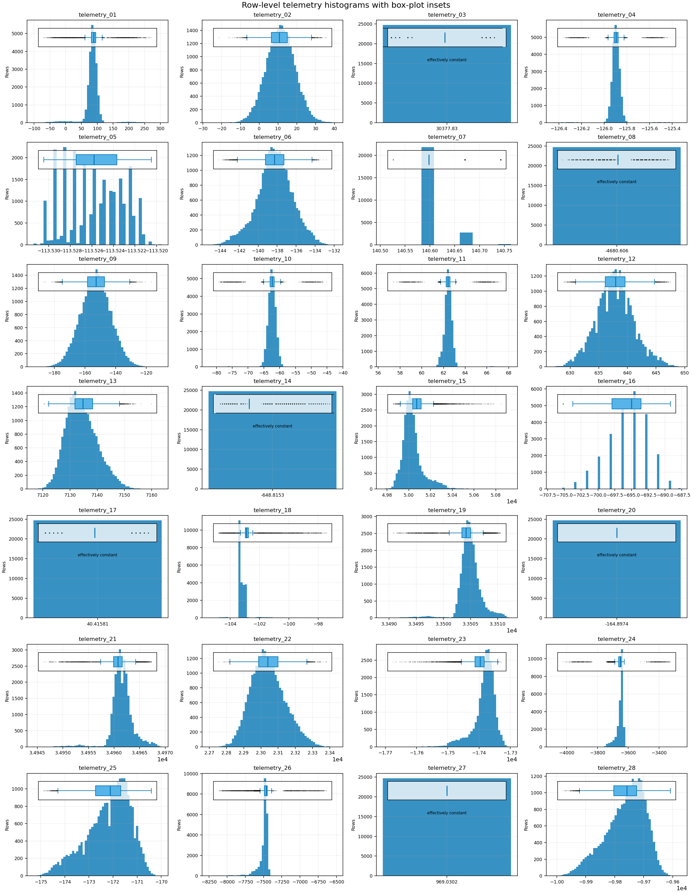

**Findings:**

- Effectively constant: `telemetry_03`, `08`, `14`, `17`, `20`, and `27` -> **Remove from the model because they contain no useful variation**
- Discrete or regime-like: `telemetry_05`, `07`, `16`, and `18` -> **Investigate as operating-state or context variables rather than continuous degradation signals**
- Approximately smooth and unimodal: `telemetry_02`, `06`, `09`, `13`, and `22` -> **No distribution transformation appears necessary; scale only if required by the model**
- Noticeably skewed: `telemetry_15`, `18`, `21`, `23`, `24`, `25`, `26`, and `28` -> **Consider robust scaling or Yeo–Johnson transformation for linear and neural models**
- Strong tails or extreme readings: `telemetry_01`, `04`, `10`, `11`, `18`, `24`, and `26` -> **Flag and investigate extreme values; use robust scaling and do not remove observations automatically**

### Within-UAV versus between-UAV variance

The variance decomposition separates changes occurring within UAV histories from persistent differences between UAVs. Channels dominated by within-UAV variation are candidates for sequence features, while channels dominated by between-UAV variation may describe operating context or UAV identity.

The plot divides each channel’s total variation into two sources:
- Dark blue: variation within the same UAV over time
- Light blue: variation between different UAVs’ average levels

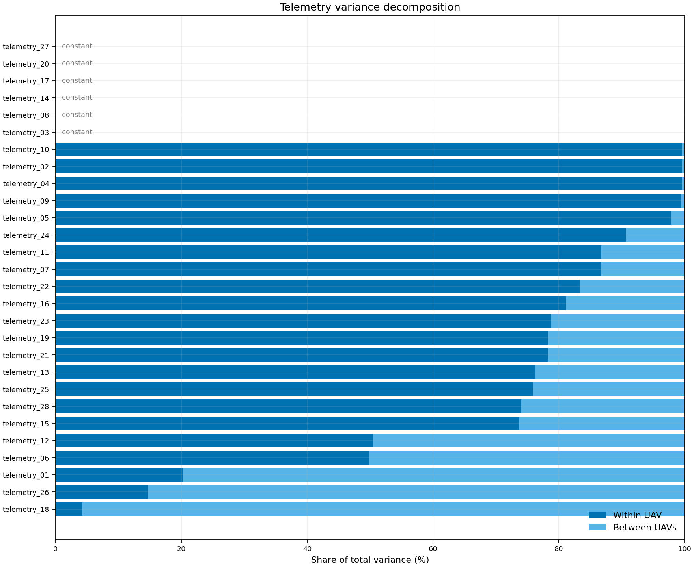

**Findings:**
- Within-UAV dominated: telemetry_02, 04, 05, 07, 09, 10, 11, 13, 15, 16, 19, 21, 22, 23, 24, 25, and 28 -> **Potential sequence features: current value, slope, rolling statistics, recent change, and baseline deviation**
- Mixed within/between variation: telemetry_06 and 12 -> **Use both the UAV baseline and temporal-change features**
- Between-UAV dominated: telemetry_01, 18, and 26 -> **Treat primarily as context or baseline features; verify that their relationship generalizes to unseen UAVs**
- Effectively constant: telemetry_03, 08, 14, 17, 20, and 27 -> **Removal candidates**

**Important caveats:**
- Within-UAV variation may be degradation, operating-state changes, or noise; the plot does not distinguish them.
- Between-UAV variation may be useful context or unwanted UAV identity.
- The graph shows variance proportions, not the absolute amount of variation.
- Final decisions require age/RUL association tests and UAV-grouped validation.

### Flatline duration

Flatline analysis measures consecutive exactly equal readings within each UAV. Long or frequent flatlines can indicate a stuck sensor, a quantized state variable, or an intentionally static operating parameter and should be interpreted before being treated as anomalies.

- Left, light blue: median of each UAV’s longest unchanged run.
- Left, dark blue: longest run observed anywhere.
- The horizontal axis is logarithmic.
- Right, yellow: percentage of UAVs containing a flatline of at least five cycles.
- Right, orange: percentage of all rows belonging to those flatlines.

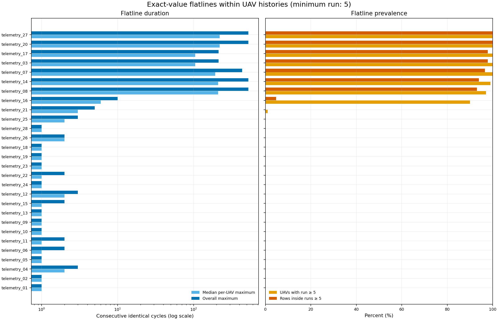

**Findings:**
- Fully constant: telemetry_20 and 27 -> **100% of their rows are flatlined; remove them**
- Effectively constant: telemetry_03, 08, 14, and 17 -> **More than 92% of their rows belong to long flatlines; remove them**
- Strongly state-like: telemetry_07 -> **Flatlines occur in every UAV and cover about 97% of rows; treat it as a discrete operating-state variable rather than a continuous sensor**
- Moderately quantized: telemetry_16 -> **90% of UAVs contain a run of at least five cycles, but only about 5% of rows are affected; consider state-level and transition features**
- Minimal flatlining: remaining channels -> **No broad flatline problem is evident**

## Summary

### 1. Channel removal

- Effectively constant: `telemetry_03`, `08`, `14`, `17`, `20`, and `27` -> **Remove them from the model because they contain no meaningful predictive variation. Keep the automated constant checks as data-quality gates.** (Source: [Within-UAV versus between-UAV variance](#within-uav-versus-between-uav-variance), [variance plot](../../0_data_analysis/broad_data_review/figures/within_between_variance/within_between_variance.png); [Flatline duration](#flatline-duration), [flatline plot](../../0_data_analysis/broad_data_review/figures/flatline_duration/flatline_duration.png))

### 2. Feature roles and engineering

- Age-linked candidates: increasing `telemetry_12`, `13`, `15`, `19`, `21`, and `22`; decreasing `telemetry_06`, `11`, `16`, `23`, `24`, `25`, `26`, and `28` -> **Prioritize them for degradation-oriented sequence features, subject to within-UAV and grouped-validation confirmation.** (Source: [Age-band statistics](#age-band-statistics), [age-band plot](../../0_data_analysis/broad_data_review/figures/age_band_statistics/age_band_statistics.png))
- Within-UAV dominated: `telemetry_02`, `04`, `05`, `07`, `09`, `10`, `11`, `13`, `15`, `16`, `19`, `21`, `22`, `23`, `24`, `25`, and `28` -> **Test current value, slope, rolling statistics, recent change, and deviation from an early-life baseline.** (Source: [Within-UAV versus between-UAV variance](#within-uav-versus-between-uav-variance), [variance plot](../../0_data_analysis/broad_data_review/figures/within_between_variance/within_between_variance.png))
- Mixed within/between variation: `telemetry_06` and `12` -> **Use both prefix-derived UAV baselines and temporal-change features.** (Source: [Within-UAV versus between-UAV variance](#within-uav-versus-between-uav-variance), [variance plot](../../0_data_analysis/broad_data_review/figures/within_between_variance/within_between_variance.png))
- Between-UAV dominated: `telemetry_01`, `18`, and `26` -> **Treat primarily as context or baseline features and verify that they generalize to unseen UAVs.** (Source: [UAV-level statistics](#uav-level-statistics), [UAV-level plot](../../0_data_analysis/broad_data_review/figures/uav_level_statistics/uav_level_statistics.png); [Within-UAV versus between-UAV variance](#within-uav-versus-between-uav-variance), [variance plot](../../0_data_analysis/broad_data_review/figures/within_between_variance/within_between_variance.png))
- Discrete or regime-like: `telemetry_05`, `07`, `16`, and `18` -> **Investigate operating-state, level, transition-count, and dwell-time features rather than assuming continuous degradation.** (Source: [Histograms and box plots](#histograms-and-box-plots), [distribution plot](../../0_data_analysis/broad_data_review/figures/histograms_boxplots/histograms_boxplots.png); [Flatline duration](#flatline-duration), [flatline plot](../../0_data_analysis/broad_data_review/figures/flatline_duration/flatline_duration.png))
- Age-stable but nonconstant: `telemetry_01`, `02`, `04`, `05`, `09`, and `10` -> **Do not treat them as primary age-degradation indicators; retain them only if context features or grouped validation add value.** (Source: [Age-band statistics](#age-band-statistics), [age-band plot](../../0_data_analysis/broad_data_review/figures/age_band_statistics/age_band_statistics.png))

### 3. Scaling, transformations, and anomaly handling

- Strongly different channel scales -> **Use robust scaling for linear, neural, distance-based, and similar scale-sensitive models; tree-based models do not require scaling.** (Source: [Descriptive statistics](#descriptive-statistics), [descriptive-statistics plot](../../0_data_analysis/broad_data_review/figures/descriptive_statistics/descriptive_statistics.png))
- Skewed continuous channels: `telemetry_15`, `21`, `23`, `24`, `25`, `26`, and `28` -> **Test robust scaling or Yeo-Johnson transformation for linear and neural models; retain the transformation only if grouped validation improves.** (Source: [Histograms and box plots](#histograms-and-box-plots), [distribution plot](../../0_data_analysis/broad_data_review/figures/histograms_boxplots/histograms_boxplots.png); [Row-level statistics](#row-level-statistics), [row-level plot](../../0_data_analysis/broad_data_review/figures/row_level_statistics/row_level_statistics.png))
- Mostly isolated extremes: `telemetry_04`, `10`, and `11` -> **Test individual-spike and synchronized-event flags instead of automatically removing the rows.** (Source: [Tukey's Range Test](#tukeys-range-test), [extreme-reading plot](../../0_data_analysis/broad_data_review/figures/Tukey_extreme_readings_investigation/Tukey_extreme_readings_overview.png))
- Mostly sustained UAV-specific extremes: `telemetry_01`, `18`, and `26` -> **Test regime flags because these patterns are more consistent with context or calibration differences than isolated sensor spikes.** (Source: [Tukey's Range Test](#tukeys-range-test), [extreme-reading plot](../../0_data_analysis/broad_data_review/figures/Tukey_extreme_readings_investigation/Tukey_extreme_readings_overview.png))
- Mixed extremes: `telemetry_24` -> **Do not clip or remove automatically; test separate low- and high-extreme flags if validation supports them.** (Source: [Tukey's Range Test](#tukeys-range-test), [extreme-reading plot](../../0_data_analysis/broad_data_review/figures/Tukey_extreme_readings_investigation/Tukey_extreme_readings_overview.png))
- All anomaly boundaries, scalers, and transformations -> **Fit them using only the training portion of each validation fold.** (Source: [Descriptive statistics](#descriptive-statistics); [Tukey's Range Test](#tukeys-range-test))

### 4. Training and validation construction

- Test histories are shorter than complete training histories, with 47% of test UAVs ending before cycle 145 -> **Train and validate on partial UAV prefixes, emphasizing cutoffs from cycles 38-144 and sampling from the observed test-length distribution.** (Source: [History-length distributions](#history-length-distributions), [history-length plot](../../0_data_analysis/broad_data_review/figures/history_length_distributions/history_length_distributions.png))
- History lengths vary from 145-525 cycles in train and 38-475 in test -> **Support variable-length inputs, give each UAV equal total weight, report metrics by cutoff band, and treat very long-cutoff results cautiously.** (Source: [History-length distributions](#history-length-distributions), [history-length plot](../../0_data_analysis/broad_data_review/figures/history_length_distributions/history_length_distributions.png))
- UAV grouping -> **Split by `uav_id` before generating prefixes; keep every prefix from one UAV in the same fold.** (Source: [History-length distributions - general validation rules](#history-length-distributions))
- Recommended starting design -> **Use five fixed UAV folds, a fixed number of cutoffs per training UAV (for example 20), and 20 locked test-like validation scenarios. Treat these numbers as configurable design choices.** (Source: [History-length distributions - general validation rules](#history-length-distributions))
- Prefix leakage control -> **Build every feature from cycles available at the cutoff only; never use full-history length, final cycle, terminal lifetime, future telemetry, or other post-cutoff information.** (Source: [History-length distributions - general validation rules](#history-length-distributions))
- Final training and inference -> **Retrain the selected pipeline on all training UAVs and predict once per test UAV from its complete available history.** (Source: [History-length distributions - general validation rules](#history-length-distributions))

### 5. Caveats and required validation

- Late-cycle fleet trends and widening IQRs may partly reflect survivor or fleet-composition effects -> **Confirm apparent degradation using consistent within-UAV trends rather than fleet aggregates alone.** (Source: [Cycle-wise fleet-level telemetry trend analysis](#cycle-wise-fleet-level-telemetry-trend-analysis), [cycle-wise plot](../../0_data_analysis/broad_data_review/figures/telemetry_over_cycles/telemetry_overview.png); [Age-band statistics](#age-band-statistics), [age-band plot](../../0_data_analysis/broad_data_review/figures/age_band_statistics/age_band_statistics.png))
- Within-UAV variation may be degradation, noise, or operating-state change, while between-UAV variation may be useful context or unwanted identity -> **Use UAV-grouped ablation tests to decide which raw and engineered features generalize.** (Source: [Within-UAV versus between-UAV variance](#within-uav-versus-between-uav-variance), [variance plot](../../0_data_analysis/broad_data_review/figures/within_between_variance/within_between_variance.png))
- Skewness, extremes, flatlines, and operating regimes do not prove predictive value -> **Keep transformations, flags, and channels only when locked grouped validation improves RUL performance.** (Source: [Row-level statistics](#row-level-statistics), [row-level plot](../../0_data_analysis/broad_data_review/figures/row_level_statistics/row_level_statistics.png); [Histograms and box plots](#histograms-and-box-plots), [distribution plot](../../0_data_analysis/broad_data_review/figures/histograms_boxplots/histograms_boxplots.png); [Flatline duration](#flatline-duration), [flatline plot](../../0_data_analysis/broad_data_review/figures/flatline_duration/flatline_duration.png))

## Core Data Analysis

As the previous chapters focused on a broad review of the data indicating the importance of certain channels and the removel of others, as well as showing that some channels include anomalies, we want to now focus actually verify and identify these.

### Temporal and RUL relationships

This analysis compares pooled correlations, age-controlled associations, within-UAV relationships, and the consistency of increasing or decreasing trends across UAVs.

- Pooled Spearman correlation compares every recorded row across the fleet:
  - Dark blue: correlation with `RUL`.
  - Light blue: correlation with `flight_cycle`.
  - Opposite signs are expected because flight cycle increases while RUL decreases.

- RUL association after controlling for cycle compares rows at approximately the same age. It indicates whether a channel distinguishes UAVs with different remaining lifetimes beyond the general age effect.

- Median within-UAV correlation measures how consistently a channel follows RUL inside individual UAV histories:
  - Negative: the channel increases as RUL decreases.
  - Positive: the channel decreases as RUL decreases.
  - Values near zero indicate little consistent temporal relationship.

- UAV trend consistency shows the percentage of UAVs sharing the same direction:
  - Positive/light blue: increases with flight cycle.
  - Negative/orange: decreases with flight cycle.
  - A value near ±100% indicates a highly consistent fleet-wide direction.

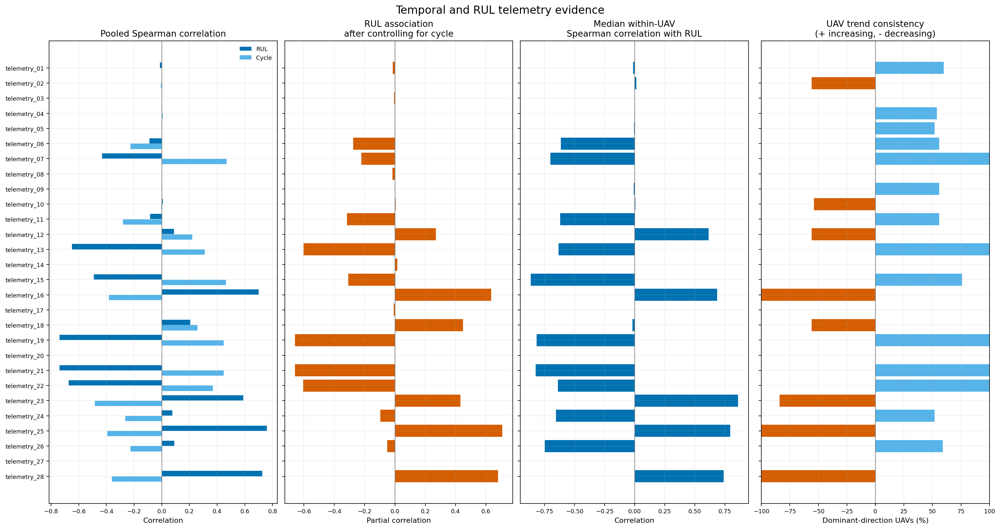

**Findings:**
- Consistently increasing with age: `telemetry_07`, `13`, `19`, `21`, and `22` increase in 100% of UAVs; `telemetry_15` increases in 76% -> **Strong degradation-feature candidates.**
- Consistently decreasing with age: `telemetry_16`, `25`, and `28` decrease in 100% of UAVs; `telemetry_23` decreases in 84% -> **Strong degradation-feature candidates.**
- `telemetry_06`, `11`, `12`, `24`, and `26` have substantial median within-UAV correlations but only 52–59% directional agreement -> **Their behavior differs between UAVs, so treat them as mixed or regime-dependent signals.**
- `telemetry_18` has a noticeable age-controlled RUL association but almost no within-UAV relationship -> **It probably represents UAV context, configuration, or baseline differences rather than degradation.**
- `telemetry_01`, `02`, `04`, `05`, `09`, and `10` have correlations close to zero -> **They provide little evidence of continuous degradation, although they may still contain context or anomaly information.**
- `telemetry_03`, `08`, `14`, `17`, `20`, and `27` contain no meaningful temporal relationship -> **Removal candidates because they are effectively constant.**
- `telemetry_07` is strongly age-related but highly flatlined -> **Interpret it as an operating-state transition rather than a continuously degrading sensor.**

Overall, prioritize `telemetry_13`, `15`, `16`, `19`, `21`, `22`, `23`, `25`, and `28` for sequence features such as current value, slope, rolling mean, and baseline deviation. Correlation alone does not prove predictive value, so these choices still require UAV-grouped validation. If the candidate repeatedly improves validation performance across different held-out UAV groups, it provides predictive value that generalizes. If it only improves training performance or random row-level validation, the apparent correlation was probably misleading.

### Representative UAV trajectories

Short-, median-, and long-history training UAVs are compared with test UAVs observed at similar ages. Values are expressed as robust Z-scores calculated from the training data so channels with different scales can be compared in one figure.

- Each horizontal row represents one telemetry channel.
- The horizontal axis represents the flight cycle.
- Red means the value is above the training median.
- Blue means the value is below the training median.
- Gray means the value is close to the training median.
- Stronger colors indicate a larger difference, capped at ±3 robust Z-scores.
- The top row contains complete training histories.
- The bottom row contains partial test histories.
- The three columns compare similar observed lengths:
  - Short: 166 training cycles versus 168 test cycles.
  - Median: 220 training cycles versus 218 test cycles.
  - Long: 347 training cycles versus 358 test cycles.

  The colors do not directly mean healthy, degraded, good, or bad. They only show how far a reading is from the typical training value.

For us, this means:
- Gradual color changes within a row indicate temporal evolution and possible degradation.
- A constant color throughout one UAV indicates a persistent baseline or operating-context difference.
- Sudden transitions between colors indicate operating-state changes, calibration shifts, or anomalies.
- Thin isolated stripes indicate individual spikes.
- Uniformly gray rows indicate constant or near-constant channels. 

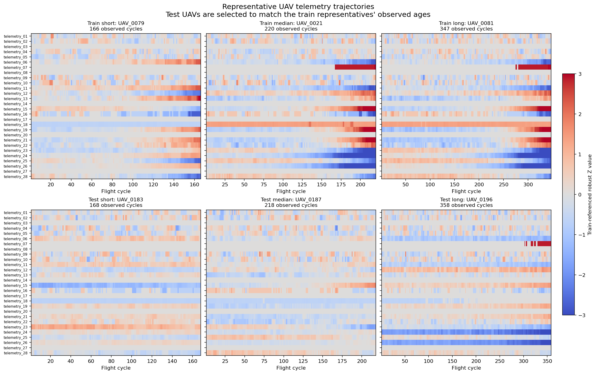

**Findings:**
- `telemetry_07` shows abrupt late-history state transitions in several UAVs -> **Treat it as an operating-state channel and test transition-cycle or dwell-time features.**
- Channels such as `telemetry_13`, `15`, `16`, `19`, `21`, `22`, `23`, `24`, `25`, `26`, and `28` show visible changes within individual histories -> **Test slopes, rolling statistics, recent changes, and baseline-deviation features.**
- `telemetry_18` often maintains a different level throughout an entire UAV history -> **Treat it primarily as a UAV baseline or operating-context feature.**
- `telemetry_01`, `02`, `04`, `05`, `09`, and `10` mostly fluctuate around a stable level without a clear common trajectory -> **They provide limited visual evidence of continuous degradation.**
- `telemetry_03`, `08`, `14`, `17`, `20`, and `27` remain essentially unchanged -> **Removal candidates.**
- Longer training histories show stronger terminal patterns than age-matched test histories -> **The test UAVs are probably observed before failure, even when their observed cycle counts match complete training lifetimes.**

This plot confirms that several fleet-level trends also occur inside individual histories. However, it shows only six representative UAVs, so it should be used for interpretation and manual review rather than final feature selection.

### Feature redundancy

Pearson and Spearman correlations are compared at row level and between UAV-level means. This reveals channel groups that may contain overlapping information and whether their relationships are temporal or primarily between UAVs.

### How to read the plot

The four heatmaps compare telemetry-channel correlations from different perspectives:

- **Row-level Pearson:** Linear relationships across all recorded cycles.
- **Row-level Spearman:** Monotonic relationships across all cycles, including nonlinear relationships.
- **UAV-mean Pearson:** Linear relationships between the average channel values of the 100 UAVs.
- **UAV-mean Spearman:** Monotonic relationships between UAV-average values.

The colors mean:

- Dark red: strong positive correlation; both channels increase together.
- Dark blue: strong negative correlation; one channel increases while the other decreases.
- Light gray: weak or no relationship.
- Gray rows and columns without a red diagonal represent effectively constant channels.
- Positive and negative correlations can both indicate redundancy when their absolute value is close to one.

### What the different comparisons tell us

- Strong correlation at both row and UAV levels means the channels contain similar temporal and UAV-baseline information.
- Much stronger UAV-level than row-level correlation means the channels distinguish UAV baselines similarly but may still behave differently over time.
- Strong Spearman but weaker Pearson correlation suggests a monotonic but nonlinear or regime-dependent relationship.
- Weak correlation across all four panels means the channel contains relatively independent information, although that does not automatically make it predictive.

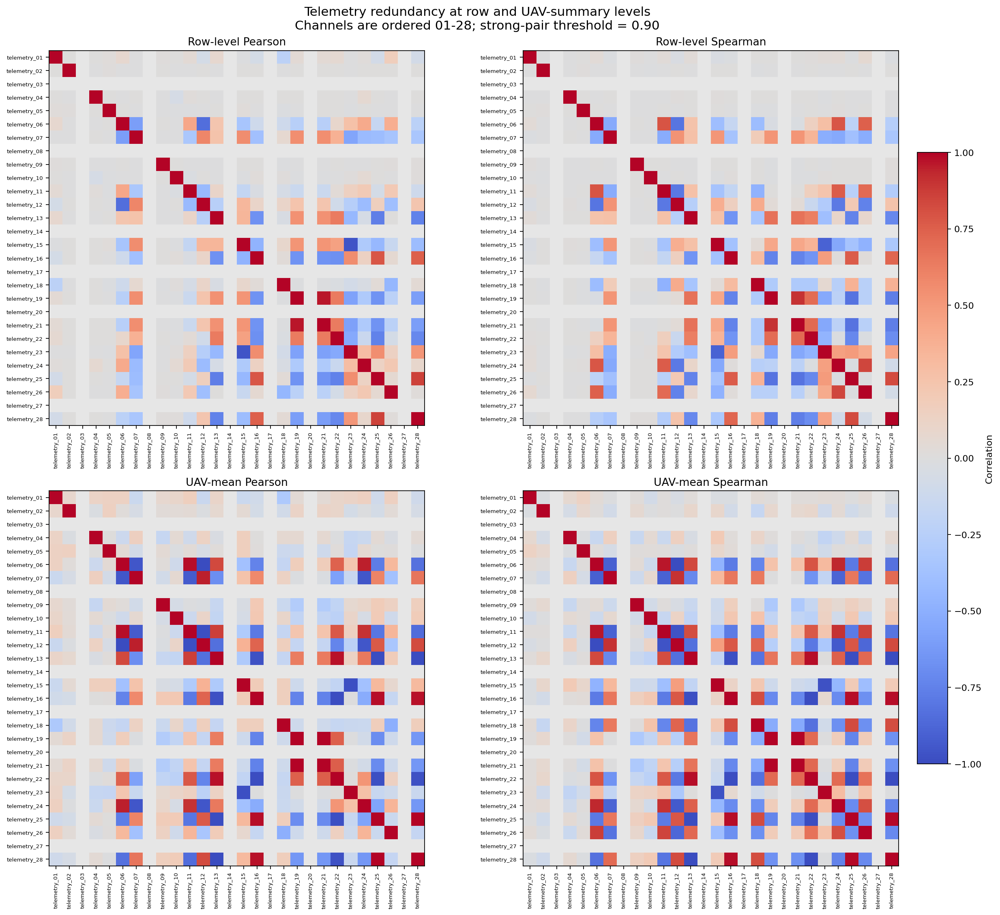

### Findings

- `telemetry_19` and `21` are almost identical at UAV level (`r ≈ 1.00`) and strongly correlated at row level (`r ≈ 0.96`) -> **They are highly redundant; test retaining one channel or one shared representation.**
- `telemetry_15` and `23` have a strong inverse relationship at row and UAV levels -> **They likely describe the same degradation process in opposite directions.**
- `telemetry_06` and `12` are almost perfectly inversely correlated between UAVs and strongly inversely correlated across rows -> **Treat them as one redundancy group and test whether both are necessary.**
- `telemetry_13`, `16`, `22`, `25`, and `28` form a strongly connected UAV-level group -> **They may represent a shared degradation dimension, although their weaker row-level relationships indicate that their temporal behavior is not completely identical.**
- `telemetry_06`, `07`, `11`, `12`, and `24` form another related group -> **Their strong UAV-level but less consistent row-level relationships suggest shared operating conditions, baselines, or regimes.**
- `telemetry_06` with `11`, and `telemetry_11` with `12`, have much stronger Spearman than Pearson relationships at row level -> **Their relationships may be nonlinear or affected by discrete operating regimes and extreme values.**
- `telemetry_01`, `02`, `04`, `05`, `09`, `10`, `18`, and `26` have no correlation above the strong-pair threshold of `0.90` -> **They provide comparatively independent information, but their predictive value must still be tested.**
- `telemetry_03`, `08`, `14`, `17`, `20`, and `27` are blank because they are effectively constant -> **Removal candidates rather than independent features.**

### What this means for feature selection

Potential redundancy groups are:

- Group 1: `telemetry_19`, `21`
- Group 2: `telemetry_15`, `23`
- Group 3: `telemetry_13`, `16`, `22`, `25`, `28`
- Group 4: `telemetry_06`, `07`, `11`, `12`, `24`

Do not automatically remove every correlated channel. First compare models using:

- All channels in the group.
- One representative channel.
- A small number of complementary channels.
- Engineered differences or ratios where physically meaningful.

If removing a channel does not reduce UAV-grouped validation performance, it is redundant for the model. When UAV-level correlation is much stronger than row-level correlation, retain channels that provide distinct within-UAV temporal behavior even if their average UAV values are similar.

### Train/test drift

Train and test telemetry distributions are compared across all rows, equally weighted UAV summaries, and test endpoints matched with training UAVs observed at the same flight cycle.

The figure compares train and test telemetry in four ways:

- **All-row mean shift:** Compares all recorded cycles. Longer-lived UAVs therefore have more influence.
- **Equal-weight UAV mean shift:** First averages each channel per UAV, giving every UAV equal weight.
- **Matched-age endpoint shift:** Compares each test UAV’s final observation with training observations from the same flight cycle. This controls for the different age distributions in train and test.
- **Endpoints outside the training range:** Shows how often a test endpoint falls outside the range observed among same-age training UAVs.

Positive values mean the test values tend to be higher; negative values mean they tend to be lower. Effectively constant channels (`telemetry_03`, `08`, `14`, `17`, `20`, and `27`) are omitted because their standardized drift cannot be interpreted meaningfully.

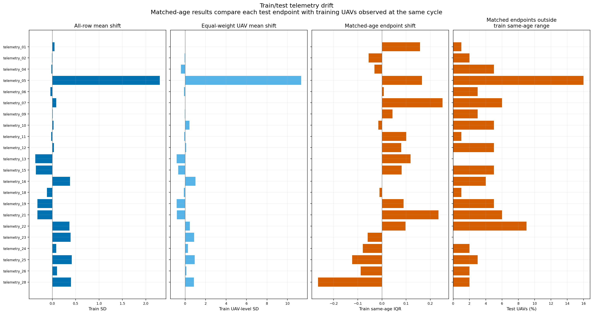

**Findings:**

- Several age-dependent channels show shifts in the row-level and UAV-level comparisons, especially `telemetry_13`, `15`, `16`, `19`, `21`, `23`, `25`, and `28`. However, most shifts become small after matching by flight cycle. -> **The apparent drift is largely caused by test UAVs having shorter histories rather than a fundamentally different telemetry distribution.**
- The median age-matched shift is below `0.27` training IQRs for every channel. The largest shifts occur for `telemetry_28` (`−0.264` IQR), `telemetry_07` (`+0.250`), and `telemetry_21` (`+0.233`). -> **There is no strong fleet-wide location shift after controlling for UAV age.**
- `telemetry_05` has an unusually large standardized mean shift (`+2.30` row-level SD and `+11.34` UAV-level SD), while its median shift is small. -> **A small number of extreme values, skewness, operating states, or a very small reference SD are driving the mean; this channel requires separate distribution and trajectory inspection.**
- Same-age test endpoints fall outside the training range most frequently for `telemetry_05` (`16%`), `telemetry_22` (`9%`), and `telemetry_07` and `21` (`6%` each). -> **Flag these channels for regime and anomaly review, but do not automatically remove or clip the observations.**
- `telemetry_04`, `10`, `12`, `15`, and `19` each have approximately `5%` of test endpoints outside their same-age training range. -> **These are secondary drift-monitoring candidates.**
- At the longest flight-cycle ages, only four training UAVs may be available for comparison. -> **Long-age drift estimates are less reliable and should be interpreted cautiously.**

**What this means for us:**

- Construct validation samples by truncating training histories to test-like cutoff cycles.
- Compare train and validation data at matched ages rather than relying only on pooled row-level distributions.
- Fit scalers, transformations, and anomaly thresholds using only the training UAVs in each fold.
- Monitor `telemetry_05`, `07`, `21`, and `22` for operating-regime or test-specific behavior.
- Report validation performance by history-length or age band because drift and training support vary with UAV age.
- Do not remove a channel solely because it shows drift; first determine whether the difference represents degradation, operating context, or unsupported test conditions.

### Anomaly diagnostics

The anomaly overview combines robust extreme readings, large cycle-to-cycle jumps, candidate persistent shifts, and the highest-priority UAVs for manual review. These flags indicate observations requiring investigation, not rows that should automatically be removed.

The figure contains four diagnostic views:

- **Train robust extremes:** Percentage of training rows more than six robust scale units from the channel’s training median.
- **Train large jumps:** Percentage of training rows with an unusually large change from the preceding cycle.
- **Candidate persistent shifts:** Percentage of training UAVs containing a large change between adjacent 10-cycle windows that persists afterward.
- **Top review candidates:** The ten highest-priority UAVs from each split. Blue represents training UAVs and orange represents test UAVs.

The composite diagnostic rank is a relative review priority based on extreme readings, large jumps, persistent shifts, unusual history length, and similarity to another UAV history. It is not an anomaly probability.

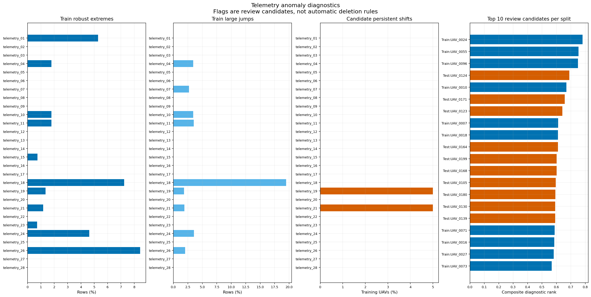

**Findings:**

- Robust extremes occur most frequently in `telemetry_26` (`8.45%`), `telemetry_18` (`7.25%`), `telemetry_01` (`5.28%`), and `telemetry_24` (`4.63%`). -> **These channels require closer inspection for skewness, extreme operating regimes, or sensor anomalies.**
- Extremes in `telemetry_01` and `18` are concentrated in only eight and nine UAVs, respectively. -> **Inspect those specific UAVs because the unusual values are not distributed across the fleet.**
- Extremes in `telemetry_04`, `10`, `11`, and `24` occur in almost every training UAV. -> **These are more likely systematic distribution characteristics or normal operating transitions than isolated sensor failures.**
- `telemetry_18` has by far the most large jumps, affecting approximately `19.48%` of rows and 84 UAVs. -> **It likely represents a discrete or rapidly changing operating condition rather than a smoothly degrading sensor.**
- `telemetry_04`, `10`, `11`, and `24` have large-jump rates of approximately `3.4–3.5%` across nearly all UAVs. -> **Their jumps appear to be recurring fleet-wide behavior and should not automatically be treated as errors.**
- `telemetry_07` has large jumps in approximately `2.69%` of rows across 44 UAVs. -> **Consider treating it as an operating-state or quantized feature.**
- Persistent shifts are detected only for `telemetry_19` and `21`, each affecting five training UAVs. -> **These shifts may be degradation change points, operating-regime changes, or sensor faults and should be inspected around the detected cycles.**
- The highest-priority training UAVs are `UAV_0024`, `UAV_0055`, and `UAV_0096`; the highest-priority test UAVs are `UAV_0124`, `UAV_0171`, and `UAV_0123`. -> **Begin manual trajectory review with these UAVs, but note that their ranking is partly influenced by unusual history length.**
- A zero bar means that no observations crossed the selected threshold. -> **It does not prove that the channel is useful, anomaly-free, or correctly measured.**

**What this means for us:**

- Inspect flagged values together with their preceding and following cycles rather than evaluating individual rows in isolation.
- Check whether flags cluster near low RUL; if they do, they may represent genuine degradation rather than measurement errors.
- Treat fleet-wide jumps as potential operating-state changes and concentrated flags as stronger anomaly candidates.
- Use persistent shifts in `telemetry_19` and `21` as possible change-point or baseline-deviation features.
- Retain anomaly indicators as model features where useful, such as the number of extremes, maximum robust Z-score, number of jumps, and time since the last shift.
- Do not automatically delete, replace, or clip flagged observations. Any anomaly-handling rule must be fitted using training data only and verified through UAV-grouped validation.

### Initial channel classification

The combined evidence is summarized as an initial screening classification covering removal, degradation, context, state or regime, anomaly, redundancy, and train/test drift indicators.

The figure combines the preceding analyses into one screening matrix:

- Each **row** represents one telemetry channel.
- Each **column** represents a possible role or warning.
- A blue cell with an `x` means that the channel meets the defined threshold for that category.
- Categories are not mutually exclusive; one channel can contain degradation information while also being redundant, anomalous, or affected by train/test drift.

This is an initial evidence-based classification, not the final feature selection.

**Classification criteria:**

- **Removal:** Effectively constant across the training data.
- **Degradation:** Within-UAV RUL correlation of at least `0.30` and the same trend direction in at least `70%` of UAVs.
- **Context:** At least `50%` of the variation occurs between UAVs.
- **State/regime:** At least `5%` of readings belong to flatline sequences.
- **Anomaly review:** At least `1%` extreme readings or jumps, or persistent shifts in at least `10%` of UAVs.
- **Redundancy:** Correlation of at least `0.90` with another channel in one of the correlation views.
- **Drift warning:** Median absolute age-matched difference of at least `0.5` training IQRs or at least `5%` of test endpoints outside the same-age training range.

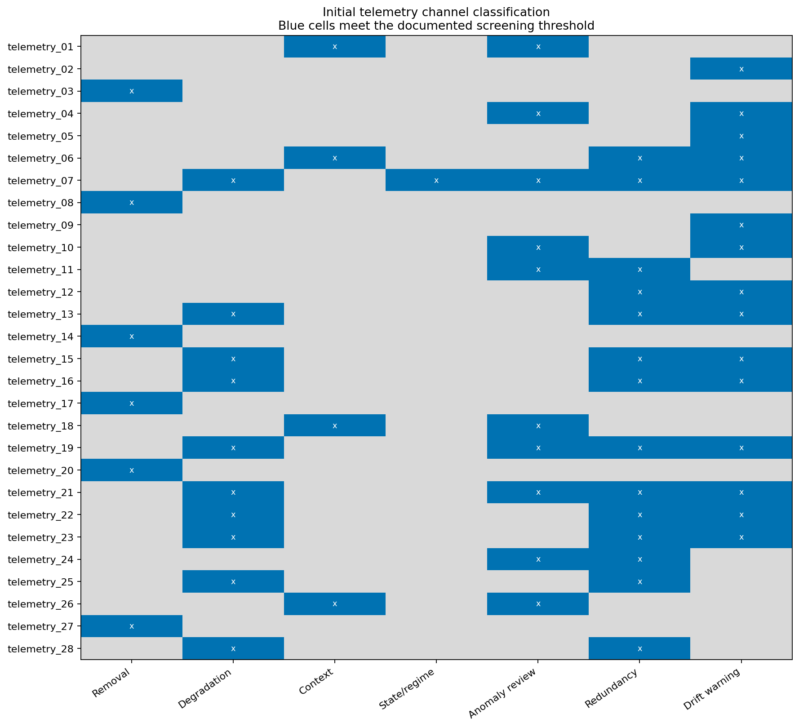

**Findings:**

- Removal candidates: `telemetry_03`, `08`, `14`, `17`, `20`, and `27`. -> **Remove these effectively constant channels from the model inputs.**
- Degradation candidates: `telemetry_07`, `13`, `15`, `16`, `19`, `21`, `22`, `23`, `25`, and `28`. -> **Use these as the initial source of temporal features such as current value, slope, rolling statistics, recent change, and baseline deviation.**
- Operating-context candidates: `telemetry_01`, `06`, `18`, and `26`. -> **Use them primarily to describe the UAV baseline or operating conditions rather than assuming that their absolute values measure degradation.**
- State/regime candidate: `telemetry_07`. -> **Its flatlines and discrete transitions may represent operating states; consider state indicators and transition features.**
- Anomaly-review channels: `telemetry_01`, `04`, `07`, `10`, `11`, `18`, `19`, `21`, `24`, and `26`. -> **Inspect their flagged cycles and UAV trajectories; do not automatically remove the observations.**
- Redundancy candidates: `telemetry_06`, `07`, `11`, `12`, `13`, `15`, `16`, `19`, `21`, `22`, `23`, `24`, `25`, and `28`. -> **Compare correlated channels during grouped validation and retain only the representatives or combinations that improve performance.**
- Important correlated groups include `telemetry_19/21`, `15/23`, `13/16/22/25/28`, and `06/07/11/12/24`. -> **These groups may contain overlapping information, so including every raw channel may add complexity without improving prediction.**
- Drift-warning channels: `telemetry_02`, `04`, `05`, `06`, `07`, `09`, `10`, `12`, `13`, `15`, `16`, `19`, `21`, `22`, and `23`. -> **Verify these channels using age-matched, UAV-grouped validation and monitor whether their relationships remain stable in test-like histories.**
- `telemetry_07` meets degradation, state/regime, anomaly, redundancy, and drift criteria. -> **It may be informative but requires careful representation and validation rather than being treated as a simple continuous sensor.**
- `telemetry_19` and `21` meet degradation, anomaly, redundancy, and drift criteria. -> **They are promising degradation indicators, but their persistent shifts, strong mutual correlation, and distribution differences require review.**
- `telemetry_25` and `28` are degradation and redundancy candidates without anomaly or drift warnings. -> **They are relatively clean temporal candidates, although their overlapping information should still be evaluated.**
- `telemetry_02`, `04`, `05`, `09`, `10`, `11`, `12`, and `24` have no clear degradation, context, or state role at the current thresholds. -> **Keep them provisionally only if grouped validation demonstrates additional predictive value.**

**What this means for us:**

- Remove the six effectively constant channels.
- Begin feature engineering with the ten degradation candidates.
- Represent context channels using UAV baselines or deviations from those baselines.
- Treat `telemetry_07` as a possible operating-state signal as well as a temporal signal.
- Use anomaly flags as additional features or review indicators, not deletion rules.
- Reduce correlated channel groups only after comparing alternatives through UAV-grouped validation.
- Treat drift warnings as validation requirements, not automatic removal criteria.
- Make the final channel selection using test-like, UAV-grouped cross-validation because this matrix summarizes statistical evidence but does not measure model performance directly.

## Core Data Analysis Summary

### 1. Channel screening

-> What information do the channels deliver?

- Removal candidates: `telemetry_03`, `08`, `14`, `17`, `20`, and `27`. ([Initial channel classification](#initial-channel-classification), [classification plot](../../0_data_analysis/core_data_analysis/figures/channel_classification/channel_classification.png))
- Degradation candidates: `telemetry_07`, `13`, `15`, `16`, `19`, `21`, `22`, `23`, `25`, and `28`. ([Initial channel classification](#initial-channel-classification), [classification plot](../../0_data_analysis/core_data_analysis/figures/channel_classification/channel_classification.png))
- Operating-context candidates: `telemetry_01`, `06`, `18`, and `26`. ([Initial channel classification](#initial-channel-classification), [classification plot](../../0_data_analysis/core_data_analysis/figures/channel_classification/channel_classification.png))
- State/regime candidate: `telemetry_07`. ([Initial channel classification](#initial-channel-classification), [classification plot](../../0_data_analysis/core_data_analysis/figures/channel_classification/channel_classification.png))
- No clear primary role at the current thresholds: `telemetry_02`, `04`, `05`, `09`, `10`, `11`, `12`, and `24`. ([Initial channel classification](#initial-channel-classification), [classification plot](../../0_data_analysis/core_data_analysis/figures/channel_classification/channel_classification.png))

### 2. Temporal evidence

-> Further analysis of what information the channels actually deliver.

- Increasing in every UAV: `telemetry_07`, `13`, `19`, `21`, and `22`; `telemetry_15` increases in `76%` of UAVs. ([Temporal and RUL relationships](#temporal-and-rul-relationships), [temporal/RUL plot](../../0_data_analysis/core_data_analysis/figures/temporal_rul/temporal_rul_summary.png))
- Decreasing in every UAV: `telemetry_16`, `25`, and `28`; `telemetry_23` decreases in `84%` of UAVs. ([Temporal and RUL relationships](#temporal-and-rul-relationships), [temporal/RUL plot](../../0_data_analysis/core_data_analysis/figures/temporal_rul/temporal_rul_summary.png))
- Mixed or regime-dependent temporal signals: `telemetry_06`, `11`, `12`, `24`, and `26`. ([Temporal and RUL relationships](#temporal-and-rul-relationships), [temporal/RUL plot](../../0_data_analysis/core_data_analysis/figures/temporal_rul/temporal_rul_summary.png))
- Limited continuous-degradation evidence: `telemetry_01`, `02`, `04`, `05`, `09`, and `10`. ([Temporal and RUL relationships](#temporal-and-rul-relationships), [representative trajectories](../../0_data_analysis/core_data_analysis/figures/representative_trajectories/representative_trajectories.png))
- Visible within-history changes: `telemetry_13`, `15`, `16`, `19`, `21`, `22`, `23`, `24`, `25`, `26`, and `28`. ([Representative UAV trajectories](#representative-uav-trajectories), [trajectory plot](../../0_data_analysis/core_data_analysis/figures/representative_trajectories/representative_trajectories.png))
- Persistent UAV-level baseline behavior: `telemetry_18`. ([Representative UAV trajectories](#representative-uav-trajectories), [trajectory plot](../../0_data_analysis/core_data_analysis/figures/representative_trajectories/representative_trajectories.png))

### 3. Feature redundancy

-> Potentially remove half of them but check through experiments.

- Redundancy groups: `telemetry_19/21`, `15/23`, `13/16/22/25/28`, and `06/07/11/12/24`. ([Feature redundancy](#feature-redundancy), [correlation heatmaps](../../0_data_analysis/core_data_analysis/figures/feature_redundancy/correlation_heatmaps.png))
- Strongest UAV-level pair: `telemetry_19/21` (`r ≈ 1.00`); strong row-level correlation also remains (`r ≈ 0.96`). ([Feature redundancy](#feature-redundancy), [correlation heatmaps](../../0_data_analysis/core_data_analysis/figures/feature_redundancy/correlation_heatmaps.png))
- No correlation above `0.90`: `telemetry_01`, `02`, `04`, `05`, `09`, `10`, `18`, and `26`. ([Feature redundancy](#feature-redundancy), [correlation heatmaps](../../0_data_analysis/core_data_analysis/figures/feature_redundancy/correlation_heatmaps.png))

### 4. Train/test compatibility

-> Shows how good generalization will work (probably).

- All age-matched median shifts are below `0.27` training IQRs; the largest are `telemetry_28` (`-0.264`), `07` (`+0.250`), and `21` (`+0.233`). ([Train/test drift](#traintest-drift), [drift plot](../../0_data_analysis/core_data_analysis/figures/train_test_drift/train_test_drift.png))
- Largest same-age outside-range rates: `telemetry_05` (`16%`), `22` (`9%`), and `07/21` (`6%`). ([Train/test drift](#traintest-drift), [drift plot](../../0_data_analysis/core_data_analysis/figures/train_test_drift/train_test_drift.png))
- Secondary outside-range rates of approximately `5%`: `telemetry_04`, `10`, `12`, `15`, and `19`. ([Train/test drift](#traintest-drift), [drift plot](../../0_data_analysis/core_data_analysis/figures/train_test_drift/train_test_drift.png))
- Longest-age comparisons contain as few as four training UAVs. ([Train/test drift](#traintest-drift), [drift plot](../../0_data_analysis/core_data_analysis/figures/train_test_drift/train_test_drift.png))

### 5. Anomaly review

-> In this dataset, most “anomalies” appear more likely to be operating regimes, UAV-specific baselines, state transitions, or genuine degradation events than simple corrupt measurements. Therefore, the current evidence does not justify deleting rows or UAVs.

- Highest robust-extreme rates: `telemetry_26` (`8.45%`), `18` (`7.25%`), `01` (`5.28%`), and `24` (`4.63%`). ([Anomaly diagnostics](#anomaly-diagnostics), [anomaly plot](../../0_data_analysis/core_data_analysis/figures/anomalies/anomaly_summary.png))
- Highest large-jump rate: `telemetry_18` (`19.48%` of rows across 84 UAVs). ([Anomaly diagnostics](#anomaly-diagnostics), [anomaly plot](../../0_data_analysis/core_data_analysis/figures/anomalies/anomaly_summary.png))
- Persistent shifts: `telemetry_19` and `21`, each in five training UAVs. ([Anomaly diagnostics](#anomaly-diagnostics), [anomaly plot](../../0_data_analysis/core_data_analysis/figures/anomalies/anomaly_summary.png))
- Highest-priority training UAVs: `UAV_0024`, `UAV_0055`, and `UAV_0096`. ([Anomaly diagnostics](#anomaly-diagnostics), [anomaly plot](../../0_data_analysis/core_data_analysis/figures/anomalies/anomaly_summary.png))
- Highest-priority test UAVs: `UAV_0124`, `UAV_0171`, and `UAV_0123`. ([Anomaly diagnostics](#anomaly-diagnostics), [anomaly plot](../../0_data_analysis/core_data_analysis/figures/anomalies/anomaly_summary.png))

## FE_run_1 model-guided feature diagnostics

`FE_run_1` adds a separate model-guided analysis after candidate Phase 1 feature
tables have been generated. It uses only training prefixes, UAV-grouped folds,
and development scenarios. Locked scenarios and labelled test outcomes are not
loaded.

Both XGBoost and ExtraTrees are fitted with fixed, predeclared settings on each
outer-training partition and predict the held-out development UAVs. Running
both models distinguishes a representation problem shared by two strong tree
families from an error pattern specific to one learner. Their paired residuals
also show whether an average ensemble could provide complementary errors.

The analysis reports:

- cross-fitted residual metrics by cutoff band and UAV anomaly-score band;
- residual correlations with endpoint telemetry channels;
- grouped permutation importance by telemetry channel and feature block;
- train/test feature drift for every candidate feature set using unlabelled
  test inputs only;
- XGBoost/ExtraTrees residual agreement and averaged-prediction RMSE.

Candidate feature transformations are retained only when their improvement is
consistent across held-out UAV folds and is not driven by one anomaly band.
This analysis screens feature recipes; it does not replace the nested model
selection or authorize opening locked scenarios.
