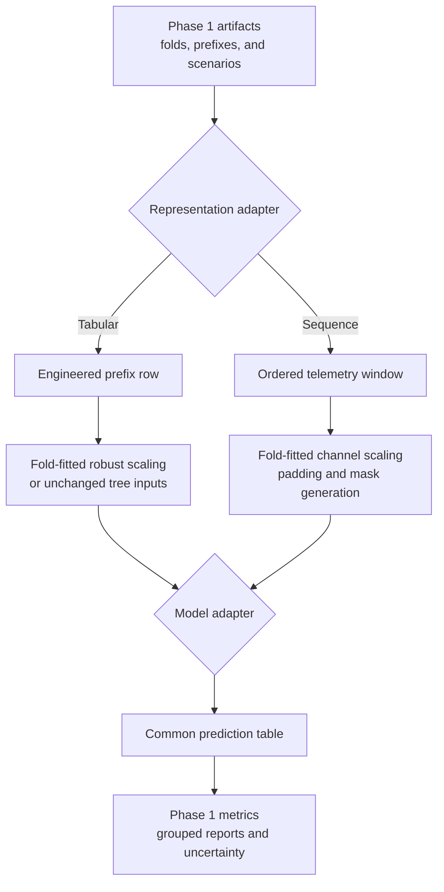
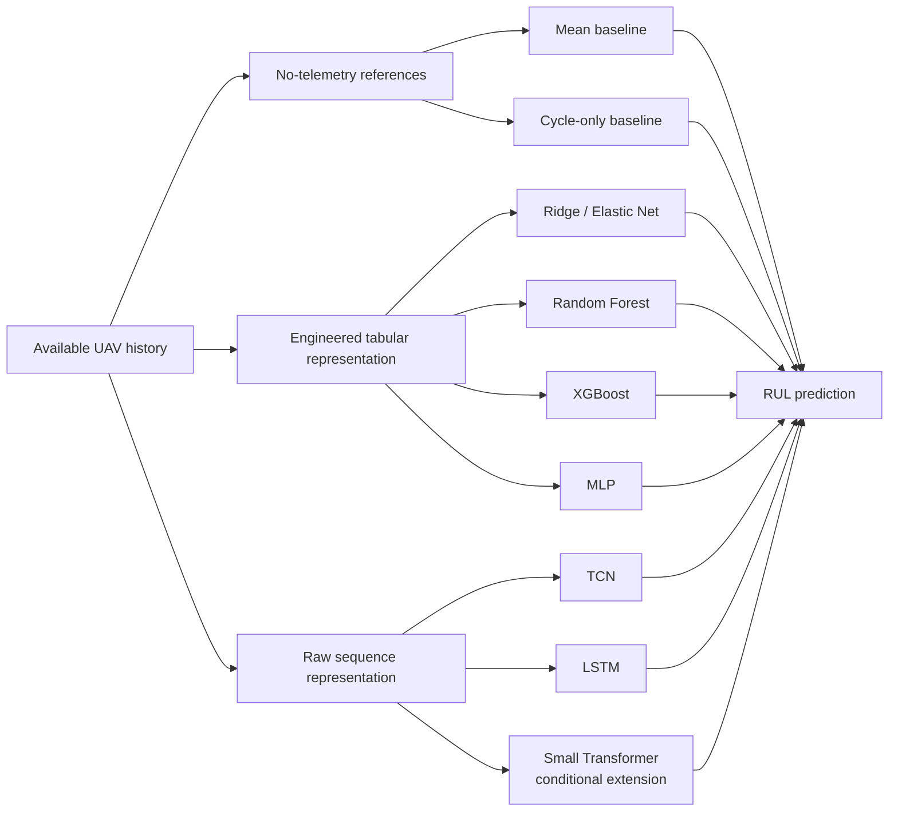
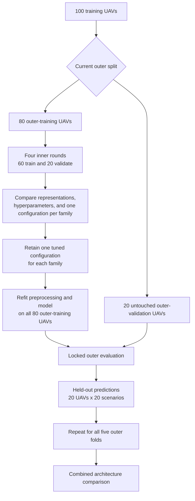
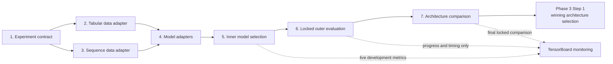

# Phase 2: Model Architecture Study

## Objective

Define and compare a small set of scientifically distinct RUL model architectures under one fixed, leakage-safe experimental procedure.

Phase 2 answers the following questions:

- Does telemetry improve RUL prediction beyond the mean and cycle-only baselines?
- How much do the engineered prefix features contribute compared with raw telemetry sequences?
- Which model family generalizes best to unseen UAVs at test-like history cutoffs?
- Is any gain from a more complex model large and stable enough to justify its additional complexity?

Phase 2 produces the evidence needed to select a model architecture and its complete input pipeline. The manual winning-architecture decision, final within-family search, training on all 100 training UAVs, and prediction of the separate test set belong to Phase 3.

## Phase entry point

The implemented [Phase 2 entry point](../../2_model_architecture_study/run_phase_2.py) delegates Steps 1–7 to their existing scripts using one Python interpreter and one fail-fast process sequence. A normal run builds the contract and adapters, completes within-family tuning, performs locked evaluation only after its gate opens, and then creates the architecture comparison. The "--status" option is read-only, while "--from-step" and "--through-step" select an inclusive step range.

Resume is based on the existing traceable checkpoint manifests. Completed Step 5 family/fold studies and complete Step 6 family/fold evaluations are preserved; no timestamp, hash, automatic architecture rank, or automatic winner is introduced. The explicit "--force" option is required to replace completed expensive work. Individual step scripts remain independently executable for diagnostics, but ordinary Phase 2 operation uses this single entry point.

## Inputs from Phase 1

The architecture study must reuse the fixed outputs of [Phase 1](phase_1_datasetConstruction.md):

- Five non-overlapping outer UAV folds.
- Four inner UAV folds inside every outer-training partition.
- Five development validation scenarios for ordinary model and hyperparameter selection.
- Twenty locked validation scenarios for the final architecture comparison.
- Twenty test-like training prefixes per UAV with equal total UAV weight.
- The `age_only`, `last_values`, `screened`, and `all_nonconstant` engineered feature sets.
- The common RUL metrics and UAV-level bootstrap procedure.
- The structural, causality, finite-value, and leakage checks.

These datasets, folds, cutoffs, targets, and metrics remain fixed during Phase 2. Changing them after seeing model results would make the architecture comparison less reliable.

## Experiment contract

Step 1 records the executable architecture-study settings before model implementation begins. The tracked [`experiment_contract.toml`](../../2_model_architecture_study/1_experiment_contract/experiment_contract.toml) is the human-readable source of truth. It contains the enabled architecture families, representations, preprocessing modes, tuning ranges, training settings, seeds, metrics, and repository-relative Phase 1 input paths.

The implementation separates building from verification:

- [`verify_experiment_contract.py`](../../2_model_architecture_study/1_experiment_contract/verify_experiment_contract.py) uses a strict Pydantic schema and rejects missing, malformed, or unknown contract fields. It also checks that all required Phase 1 artifacts exist, that the Phase 1 leakage report passed, and that the expected JSON keys, CSV columns, row counts, and feature counts are present. It does not repeat the raw-data audit and never modifies files.
- [`build_experiment_contract.py`](../../2_model_architecture_study/1_experiment_contract/build_experiment_contract.py) runs the verifier and writes `artifacts/experiment_specification.json` only after all checks pass. Identical TOML and Phase 1 inputs produce identical JSON; timestamps, absolute paths, machine names, hashes, and lock state are not added.

The contract uses a manually maintained positive integer `contract_version`. When an experiment setting changes, this version must be incremented and dependent Phase 2 artifacts must be regenerated. The code does not freeze the contract; avoiding changes after locked results have been inspected remains an explicit experimental rule.

The initial model status is:

- **Required and enabled:** mean baseline, cycle-only baseline, the combined Ridge/Elastic Net family, Random Forest, XGBoost, MLP, TCN, and LSTM.
- **Conditional and disabled:** small Transformer encoder.
- **Optional and disabled:** RBF-SVR.

Deferred models remain in this document but are deliberately absent from the executable contract. Hyperparameter tuning occurs separately within every enabled architecture. The pipeline saves and plots all architecture results but does not rank them or select a winner; the final architecture decision is made manually.

## Tabular data adapter

Step 2 implements the shared tabular input boundary in [2_tabular_data_adapter](../../2_model_architecture_study/2_tabular_data_adapter/README.md). It reads the resolved JSON produced by Step 1 and copies the seven Phase 1 feature, catalog, and fold files required by tabular models into its own local artifact directory.

The implementation has three separate responsibilities:

- [build_tabular_data_adapter.py](../../2_model_architecture_study/2_tabular_data_adapter/build_tabular_data_adapter.py) refreshes the seven copies with preserved modification timestamps, writes the compact dataset manifest, and automatically invokes copy verification.
- [verify_copied_files.py](../../2_model_architecture_study/2_tabular_data_adapter/verify_copied_files.py) checks source and copy existence, byte size, modification timestamp, and complete byte equality. It writes "copy_verification.json" and does not use hashes or repeat the Phase 1 data audit.
- [tabular_data_adapter.py](../../2_model_architecture_study/2_tabular_data_adapter/tabular_data_adapter.py) loads only requested feature columns, keeps features separate from metadata, RUL targets, and sample weights, and creates the fixed inner-selection and locked outer-evaluation UAV splits.

The adapter reads only its Step 2 copies after they have been generated. It preserves source row order and feature-catalog order, performs no scaling or imputation, and never silently falls back to Phase 1 files. Fold-fitted preprocessing therefore remains the responsibility of the later training pipeline.

## Sequence data adapter

Step 3 implements the raw telemetry representation in [3_sequence_data_adapter](../../2_model_architecture_study/3_sequence_data_adapter/README.md). Its builder copies the raw train/test histories, four endpoint tables, and two UAV-fold tables into its local artifact directory. The generated "sequence_dataset_manifest.json" records the ordered channels, lookbacks, mask convention, side features, scaling rule, and source provenance. A copy report confirms existence, size, preserved timestamps, and complete byte equality without storing hashes.

[sequence_data_adapter.py](../../2_model_architecture_study/3_sequence_data_adapter/sequence_data_adapter.py) constructs tensors only when requested. For every endpoint it selects the trailing 50, 100, or 200 cycles ending exactly at the cutoff, left-pads shorter histories with zeros, marks padded positions as True in the Boolean mask, and returns flight cycle and log-transformed flight cycle as separate side features. It preserves endpoint order and never includes post-cutoff telemetry.

The inner-selection and locked-outer methods derive UAV membership from the copied fold assignments. They fit channel medians and IQR-based scales on complete histories from the active training UAVs only, apply the same parameters to both sides of the split, and keep padded values equal to zero. The fitted scaling is independent of lookback, excludes all validation UAVs, and leaves age side features unscaled.

## Model adapters

Step 4 implements the common estimator boundary in [4_model_adapters](../../2_model_architecture_study/4_model_adapters/README.md). The model registry connects every family in the experiment contract to one concrete adapter class. The eight required families are enabled; the conditional Transformer and optional RBF-SVR are implemented but remain disabled by the contract.

The implementation separates shared experiment behavior from architecture-specific model code:

- [base.py](../../2_model_architecture_study/4_model_adapters/base.py) defines the common fitting, prediction, nonnegative clipping, training-summary, and trusted-local persistence behavior.
- [models/baselines](../../2_model_architecture_study/4_model_adapters/models/baselines/) contains separate weighted mean and cycle-only baseline modules.
- [models/tabular](../../2_model_architecture_study/4_model_adapters/models/tabular/) contains separate Ridge and Elastic Net estimator modules plus the shared regularized-family adapter, and one module each for Random Forest, XGBoost, and optional RBF-SVR.
- [models/neural](../../2_model_architecture_study/4_model_adapters/models/neural/) contains one module each for MLP, causal TCN, packed unidirectional LSTM, and masked Transformer. The category retains one shared weighted PyTorch training loop and one shared sequence-input adapter so architecture modules do not duplicate training or validation behavior.
- [model_registry.py](../../2_model_architecture_study/4_model_adapters/model_registry.py) validates resolved hyperparameter names, enforces enabled/disabled contract status, and creates the requested adapter without selecting or ranking architectures.
- [build_model_registry.py](../../2_model_architecture_study/4_model_adapters/build_model_registry.py) writes "artifacts/model_registry.json" with the contract version, adapter mapping, representation requirements, enabled status, supported configuration fields, and installed library versions. It records no hashes or timestamps.

Fold-sensitive preprocessing is stored with the fitted model. Ridge, Elastic Net, MLP, and RBF-SVR fit robust tabular scaling using only the supplied training rows; Random Forest and XGBoost use unscaled tabular features. Sequence models consume Step 3's fold-scaled telemetry and fit a separate robust scaler for the two age side features from their supplied training rows. Every family uses the sample weights already carried by its Step 2 or Step 3 dataset.

XGBoost and the neural adapters support validation-based early stopping during inner-fold fitting and an explicit fixed iteration or epoch count during outer-fold retraining. The later runner must derive that fixed duration from the median inner-fold best duration, so outer-validation targets never control training length. Step 4 does not perform tuning, evaluation, plotting, architecture ranking, or winner selection.

## Inner model selection

Step 5 implements automatic selection within each enabled architecture family in [5_inner_model_selection](../../2_model_architecture_study/5_inner_model_selection/README.md). One independent Optuna study covers one model family and one outer fold. Mean and cycle-only baselines receive one fixed candidate; every tunable family receives up to 25 distinct candidates from the Step 1 contract.

[candidate_space.py](../../2_model_architecture_study/5_inner_model_selection/candidate_space.py) resolves the feature set or sequence lookback together with the model hyperparameters. It maps the fixed, categorical, uniform, log-uniform, and hidden-layer alternatives to an Optuna TPE study using search seed 13. The combined Ridge/Elastic Net family uses a conditional space so inactive variant parameters do not consume tuning trials.

[inner_model_selection.py](../../2_model_architecture_study/5_inner_model_selection/inner_model_selection.py) evaluates every candidate across the four actual inner-fold labels from the copied fold tables. Each split is checked for disjoint UAV groups, training weights, RUL targets, and exactly five development scenarios. Fold-specific preprocessing and model fitting are repeated independently. The objective is the mean of the four inner-validation RMSE values.

Each family/fold study writes candidate, fold-level, selected-configuration, and status checkpoints below "artifacts/studies/". The consolidated "candidate_results.csv", "inner_fold_results.csv", and "selected_configurations.csv" expose all completed work. "selection_manifest.json" remains "partial" until all 40 enabled family/fold studies are complete and explicitly records that neither locked nor test data was loaded.

For XGBoost and neural candidates, Step 5 records the best duration in every inner fold. The median is rounded to the nearest integer with half values rounded upward and stored as "outer_retraining_iterations". Step 6 must retrain with this fixed duration instead of using locked targets for early stopping.

The inexpensive mean and cycle-only studies have been generated for all five outer folds, producing 10 completed studies, 10 candidate rows, and 40 inner-fold rows. The manifest correctly remains partial until the six tunable families finish their 25-candidate searches. This partial execution demonstrates the artifact flow but is not the completed architecture study.

## Locked outer evaluation

Step 6 implements held-out evaluation in [6_locked_outer_evaluation](../../2_model_architecture_study/6_locked_outer_evaluation/README.md). [evaluation_gate.py](../../2_model_architecture_study/6_locked_outer_evaluation/evaluation_gate.py) runs before either data adapter is constructed. It requires a complete Step 5 manifest, all 40 family/fold selections, a matching contract version, valid configuration fields, and confirmation that Step 5 used neither locked nor test data. There is no bypass option.

[locked_outer_evaluation.py](../../2_model_architecture_study/6_locked_outer_evaluation/locked_outer_evaluation.py) retrains each selected configuration on the 80 outer-training UAVs and then predicts the 20 held-out UAVs across 20 locked scenarios. It verifies 1,600 training prefixes, 400 validation endpoints, disjoint UAV groups, correct fold membership, unique scenario/UAV keys, and total training weight 1 per UAV.

Locked validation data is never passed to the model's fitting method. XGBoost and neural adapters receive the fixed "outer_retraining_iterations" selected from the median inner-fold stopping duration. Predictions are generated only after fitting finishes, so locked targets cannot influence preprocessing, parameters, early stopping, or training duration.

Random Forest, XGBoost, MLP, TCN, LSTM, and an enabled Transformer are marked stochastic and run with seeds 13, 37, and 73. Deterministic families run once with seed 13. The current eight-family contract therefore requires 90 family/fold/seed runs and produces 36,000 prediction rows.

Every run writes its fitted model, 400-row prediction table, training and inference facts, and status checkpoint. The consolidated "locked_predictions.csv.gz", "model_runs.csv", and "locked_evaluation_manifest.json" include only complete runs. Step 6 records all architecture results but calculates no ranking and chooses no winner.

The earlier partial Step 5 outputs were removed before mandatory TensorBoard monitoring was added. The new architecture study therefore starts from zero with one monitoring policy applied to every fit. The Step 6 gate continues to reject incomplete Step 5 state before locked data access.

## Architecture comparison implementation

Step 7 implements the fixed reporting stage in [7_architecture_comparison](../../2_model_architecture_study/7_architecture_comparison/README.md). [comparison_gate.py](../../2_model_architecture_study/7_architecture_comparison/comparison_gate.py) requires the complete Step 6 manifest before either consolidated locked-result table is opened. It verifies run counts, prediction counts, the contract version, the fixed-duration rule, the absence of test-data access and locked-result tuning, and the manual-selection setting. There is no bypass option.

[architecture_comparison.py](../../2_model_architecture_study/7_architecture_comparison/architecture_comparison.py) checks complete family/fold/seed coverage and identical locked endpoints across architectures. It saves R2, RMSE, MAE, and bias overall and by outer fold, scenario, age band, and lifetime quantile. Individual-seed metrics and their mean and population standard deviation are retained. Metric values are averaged across seeds; predictions are not averaged because that would create an undeclared ensemble.

The uncertainty calculation applies the same 1,000 whole-UAV bootstrap resamples to every architecture and seed. It saves architecture intervals and every paired family A minus family B interval. [plot_architecture_comparison.py](../../2_model_architecture_study/7_architecture_comparison/plot_architecture_comparison.py) creates the declared performance, uncertainty, reliability, seed-stability, paired-difference, and efficiency figures in contract order. No score, rank, best-seed rule, winner artifact, or automatic architecture decision is produced.

Step 7 is implemented but intentionally cannot generate real comparison artifacts while Step 5 and consequently Step 6 remain incomplete. Its gate rejects the current state before locked results are loaded.

## Real-time TensorBoard monitoring

[tensorboard_monitoring](../../2_model_architecture_study/tensorboard_monitoring/README.md) is a required sidecar to the numbered Phase 2 steps. The monitoring package owns SummaryWriter creation, safe stable paths, scalar naming, flush behavior, and the separate dashboard launcher. The experiment runners pass only a small run context and scalar dictionaries; the model implementations do not import TensorBoard.

Every fit records its architecture, representation, fold, seed, candidate, feature set or lookback, hyperparameters, row and feature counts, state, training duration, inference duration, completed epochs or iterations, stopping point, and parameter count when available. Step 5 additionally records overall and age-band development RMSE, MAE, R2, and bias for every inner fold and the mean-RMSE tuning curve for every candidate.

The iterative depth follows each model's actual training interface:

- neural architectures report weighted training MSE, validation RMSE, learning rate, epoch duration, best validation RMSE, and early-stopping patience every epoch;
- XGBoost reports weighted training and validation RMSE plus iteration timing every ten boosting rounds and at the final round;
- baselines, regularized linear models, Random Forest, and RBF-SVR report fit-level configuration, dimensions, timing, completion, and final permitted metrics because their libraries expose one atomic fitting call.

Weights, gradients, full prediction arrays, feature histograms, and hardware sampling are excluded to keep the log volume and integration surface small. Generated event files are ignored by Git; the Step 5 through Step 7 CSV and JSON artifacts remain the authoritative scientific record.

The locked-evaluation boundary also applies to monitoring. Step 6 exposes training progress and operational timing but does not publish locked RMSE, MAE, R2, bias, predictions, or residuals while runs are in progress. Step 7 publishes the final locked metric, uncertainty, stability, and efficiency views only after all Step 6 runs have completed and the comparison gate has passed. TensorBoard provides no automatic architecture rank or winner.

## What is compared

In this study, an **architecture** means the complete path from an available UAV history to one RUL prediction:

```text
Representation -> preprocessing -> model family -> hyperparameters -> RUL prediction
```

The estimator is only one module of that path. Tabular models consume the engineered prefix rows from Phase 1, whereas temporal models consume ordered telemetry sequences. Therefore, one modular experiment runner can be shared, but the representation and preprocessing modules must also be exchangeable.

## One modular experiment pipeline

All candidates use the same experiment shell. The two representation paths differ only where their data requirements differ and rejoin at a common prediction and evaluation contract:



The common configuration should identify at least:

```yaml
representation: tabular | sequence
feature_set: age_only | last_values | screened | all_nonconstant | null
preprocessing: robust_scaled | unscaled_tree | sequence_scaled
model_family: ridge | elastic_net | random_forest | xgboost | mlp | tcn | lstm | transformer
lookback: null | 50 | 100 | 200
hyperparameters: {}
seed: 13
```

Every model adapter exposes the same logical interface. The dataset contains
its target and sample weights, while the adapter configuration contains its
seed:

```python
fit(training_data, validation_data)
predict(data)
save(path)
load(path)
```

The internal implementation may differ between scikit-learn-style estimators and PyTorch models, but every adapter must produce the same prediction schema:

| Column | Meaning |
| --- | --- |
| `model_family` | Evaluated architecture family |
| `configuration_id` | Reproducible model and preprocessing configuration |
| `seed` | Training seed |
| `outer_fold` | Fold in which the UAV was held out |
| `scenario` | Development or locked cutoff scenario |
| `uav_id` | Evaluated UAV |
| `cutoff` | Last cycle available to the model |
| `y_true` | True RUL at the cutoff |
| `y_pred` | Predicted RUL |

All model predictions are clipped to a minimum of zero before metric calculation. No upper RUL limit is imposed.

Every model must preserve Phase 1's equal-UAV weighting. Each of the 20 prefixes from one UAV carries weight `1/20`. Tabular estimators receive these weights through their fitting interface. Neural models use the same weights in the regression loss or an equivalent UAV-balanced batch sampler. No architecture may gain influence merely by seeing more prefixes or longer histories from one UAV.

## Input representations

### Engineered tabular representation

The tabular path uses one Phase 1 feature row per UAV prefix. It supports the four existing feature sets:

- **`age_only`:** `flight_cycle` and `log(1 + flight_cycle)`.
- **`last_values`:** age plus the latest value of every nonconstant telemetry channel.
- **`screened`:** temporal features for the degradation candidates and level/baseline summaries for context channels.
- **`all_nonconstant`:** all 606 engineered features from the 22 nonconstant channels.

Ridge, Elastic Net, and MLP receive robustly scaled features. Random Forest and XGBoost receive the original unscaled feature values because their split decisions do not depend on feature units. During inner validation, preprocessing must be refitted using only the 60 inner-training UAVs; the outer-fold scalers created in Phase 1 cannot be reused for inner model selection.

### Raw sequence representation

The sequence path uses the 22 nonconstant telemetry channels in flight-cycle order. The initial comparison deliberately retains the same channels for TCN and LSTM so that the model family, rather than a different channel subset, is being tested.

For a prediction at cutoff `c`:

- Use only cycles at or before `c`.
- Use a trailing lookback window of 50, 100, or 200 cycles.
- If fewer cycles are available, left-pad the sequence and provide a binary padding mask.
- Scale every telemetry channel using parameters fitted only on the corresponding inner- or outer-training UAVs.
- Supply `flight_cycle` and `log(1 + flight_cycle)` as side features to the final regression head.
- Predict the original, uncapped RUL target used in Phase 1.

The lookback is a hyperparameter selected through inner validation. Using several candidate lengths checks whether the model benefits from short recent behaviour or a longer degradation history while keeping the comparison computationally manageable.

## Architecture candidates from the lecture notes and literature

The lecture notes cover linear regression, support-vector machines, nearest neighbours, neural networks, trees and boosting, CNNs, recurrent networks, LSTM/GRU models, Transformers, and advanced operator-learning methods. See Lectures 2, 4-7, 10, and 12 in the [MLiM Lecture Notes](../MLiM_Lecture_Notes.pdf).

The following table separates the available families from the models that should form the first controlled study.

| Model family | Input | Scientific role | Phase 2 status |
| --- | --- | --- | --- |
| Mean predictor | None | Minimum sanity baseline | Required |
| Cycle-only linear model | Age | Existing non-telemetry baseline | Required |
| Ridge / Elastic Net | Engineered features | Regularized linear reference | Required |
| Random Forest | Engineered features | Nonlinear bagging/tree reference | Required |
| XGBoost | Engineered features | Nonlinear gradient-boosting reference | Required |
| MLP | Engineered features | Neural model without explicit sequence processing | Required |
| TCN / 1D CNN | Raw telemetry sequence | Convolutional temporal model | Required |
| LSTM | Raw telemetry sequence | Recurrent temporal model | Required |
| Small Transformer encoder | Raw telemetry sequence | Attention-based temporal model | Conditional extension |
| RBF-SVR | Engineered features | Kernel-based nonlinear reference | Optional extension |
| KNN | Engineered features | Local distance-based reference | Not in the core study |
| Single decision tree | Engineered features | Interpretable but unstable tree reference | Not in the core study |
| Vanilla RNN | Raw telemetry sequence | Basic recurrent reference | Not in the core study |
| GRU | Raw telemetry sequence | LSTM-like gated recurrent alternative | Later ablation only |
| CNN-LSTM or attention hybrids | Raw telemetry sequence | Higher-capacity combined model | Later extension only |
| Autoencoders | Raw or latent sequence | Unsupervised representation learning | Later extension only |
| Neural ODE, DeepONet, FNO | Continuous or functional representation | Advanced operator/dynamics modelling | Outside the initial study |

### Mean and cycle-only baselines

The mean predictor establishes the performance of predicting the training-fold mean RUL. The existing cycle-only regression from Phase 1 establishes how much RUL can be predicted from age without telemetry. Every telemetry model must clearly improve on both baselines.

### Regularized linear family

Ridge and Elastic Net provide a low-variance, interpretable reference for the engineered features. Ridge stabilizes coefficients when features are correlated; Elastic Net additionally permits sparse coefficients while retaining correlated feature groups. This is relevant because Phase 0 found several highly redundant telemetry and derived-feature groups. The regularization type and strength are selected in inner validation. See the [scikit-learn linear-model documentation](https://scikit-learn.org/stable/modules/linear_model.html).

### Random Forest

Random Forest represents bagging-based nonlinear models. It can learn interactions and thresholds in the engineered features, requires no scaling, and provides a useful contrast to boosting. It is included as an ensemble family rather than relying on one high-variance decision tree. See the [RandomForestRegressor documentation](https://scikit-learn.org/stable/modules/generated/sklearn.ensemble.RandomForestRegressor.html) and Lecture 5 in the [MLiM Lecture Notes](../MLiM_Lecture_Notes.pdf).

### XGBoost

XGBoost represents regularized gradient-boosted trees. It is a strong tabular-data candidate and differs scientifically from Random Forest because trees are added sequentially to correct current residual errors rather than fitted independently and averaged. The original method includes regularization, row/column subsampling, and second-order optimization. See [Chen and Guestrin, 2016](https://doi.org/10.1145/2939672.2939785) and Lecture 5 in the [MLiM Lecture Notes](../MLiM_Lecture_Notes.pdf).

### Multilayer perceptron

The MLP uses the same engineered features as the classical tabular models but learns nonlinear interactions through fully connected layers. It tests whether neural nonlinearities add value when temporal behaviour has already been summarized by feature engineering. It does not test automatic sequence learning. See Lecture 4 in the [MLiM Lecture Notes](../MLiM_Lecture_Notes.pdf).

### TCN / 1D CNN

The TCN uses causal one-dimensional convolutions over the telemetry history. Dilated convolutions allow a longer receptive field without recurrence, while residual connections support stable training. It tests whether local patterns and multi-scale recent changes can be learned directly from telemetry. Convolutional RUL models are established in prognostics literature, and generic TCNs have been shown to be strong sequence-modelling baselines. See [Li, Ding, and Sun, 2018](https://doi.org/10.1016/j.ress.2017.11.021), [Bai, Kolter, and Koltun, 2018](https://arxiv.org/abs/1803.01271), and Lecture 6 in the [MLiM Lecture Notes](../MLiM_Lecture_Notes.pdf).

### LSTM

The LSTM processes telemetry recurrently and is designed to retain information over longer temporal dependencies than a vanilla RNN. It is the principal recurrent architecture in the study and provides a direct comparison with the convolutional TCN. LSTM models have been applied specifically to RUL estimation. See [Zheng et al., 2017](https://doi.org/10.1109/ICPHM.2017.7998311) and Lecture 7 in the [MLiM Lecture Notes](../MLiM_Lecture_Notes.pdf).

### Small Transformer encoder

A Transformer uses self-attention rather than convolution or recurrence to combine information across time. It is available and relevant to multivariate RUL prediction, but it is conditional rather than part of the minimum study because the dataset contains only 100 independent training UAVs. The 2,000 prefixes are correlated views of those UAVs and must not be treated as 2,000 independent run-to-failure histories. A Transformer should therefore be tested only after the TCN and LSTM pipelines work, using a small encoder and strong regularization. See [Vaswani et al., 2017](https://arxiv.org/abs/1706.03762), [Ogunfowora and Najjaran, 2023](https://arxiv.org/abs/2308.09884), and Lecture 10 in the [MLiM Lecture Notes](../MLiM_Lecture_Notes.pdf).

## Core architecture study

The first study should compare the following distinct hypotheses:

```text
Mean baseline             -> No age and no telemetry
Cycle-only baseline       -> Age alone
Regularized linear model  -> Linear use of engineered history
Random Forest             -> Bagged nonlinear rules on engineered history
XGBoost                   -> Boosted nonlinear rules on engineered history
MLP                       -> Neural nonlinearities on engineered history
TCN                       -> Convolutional learning from raw sequences
LSTM                      -> Recurrent learning from raw sequences
```

This set is broad enough to compare simple versus complex, linear versus nonlinear, bagging versus boosting, and engineered versus learned temporal representations without testing many nearly identical variants.



### Required experiment matrix

| Architecture | Representation alternatives selected by inner validation |
| --- | --- |
| Mean baseline | No model features |
| Cycle-only baseline | `age_only` |
| Ridge / Elastic Net family | `age_only`, `last_values`, `screened`, `all_nonconstant` |
| Random Forest | `last_values`, `screened`, `all_nonconstant` |
| XGBoost | `last_values`, `screened`, `all_nonconstant` |
| MLP | `last_values`, `screened`, `all_nonconstant` |
| TCN | Raw 22-channel sequence; lookback 50, 100, or 200 |
| LSTM | Raw 22-channel sequence; lookback 50, 100, or 200 |
| Transformer | Same sequence inputs and lookbacks, only if the conditional extension is run |

The feature set or lookback is part of the configuration selected inside the inner folds. It must not be selected from locked-scenario results.

## Hyperparameter-search boundaries

Search spaces must be fixed before locked evaluation. The following initial boundaries keep model capacity appropriate for the small number of independent UAVs:

| Family | Initial search space recorded in the contract |
| --- | --- |
| Ridge | `alpha`: log-uniform from `1e-4` to `1e4` |
| Elastic Net | `alpha`: log-uniform from `1e-5` to `1e2`; `l1_ratio`: `0.05`, `0.2`, `0.5`, `0.8`, or `0.95` |
| Random Forest | `n_estimators`: `500`; `max_depth`: `None`, `5`, `10`, or `20`; `min_samples_leaf`: `1`, `2`, `5`, or `10`; `max_features`: `0.33`, `0.67`, or `1.0` |
| XGBoost | At most `2,000` trees with early stopping; `learning_rate`: `0.01-0.2`; `max_depth`: `2`, `3`, `4`, `6`, or `8`; `min_child_weight`: `0.5-20`; `subsample`: `0.6-1.0`; `colsample_bytree`: `0.5-1.0`; L1/L2 penalties on logarithmic scales |
| MLP | Hidden layers: `[64]`, `[128, 64]`, or `[256, 128]`; dropout: `0.0-0.5`; weight decay: `1e-6` to `1e-2`; learning rate: `1e-4` to `3e-3` |
| TCN | Residual blocks: `2-4`; channels: `32`, `64`, or `128`; kernel: `3`, `5`, or `7`; exponentially increasing dilations; dropout: `0.1-0.5`; lookback: `50`, `100`, or `200` |
| LSTM | Unidirectional layers: `1` or `2`; hidden units: `32`, `64`, or `128`; dropout: `0.1-0.5`; learning rate: `1e-4` to `3e-3`; lookback: `50`, `100`, or `200` |
| Transformer | Encoder layers: `1-3`; model width: `32`, `64`, or `128`; compatible attention heads: `2`, `4`, or `8`; feed-forward ratio: `2` or `4`; sinusoidal position encoding; dropout: `0.1-0.5`; lookback: `50`, `100`, or `200` |

Each family receives at most 25 distinct candidate configurations per outer fold, generated from a fixed search seed. A smaller exact grid is allowed when it exhausts the complete predefined space. Feature-set and lookback choices count as parts of these configurations rather than receiving a separate tuning budget. Manual extra tuning after viewing locked results is prohibited.

Neural models use weighted mean squared error, AdamW, batch size 64, at most 300 epochs, early-stopping patience of 25 epochs, and global-norm gradient clipping at 1.0. Their learning rate and weight decay share the ranges `1e-4` to `3e-3` and `1e-6` to `1e-2`. XGBoost uses early-stopping patience of 50 rounds. The validation data used for early stopping must belong only to the relevant inner fold.

When a tuned configuration is retrained on all 80 outer-training UAVs, the outer-validation UAVs cannot determine its training duration. The fixed epoch or boosting-round count is therefore the median best iteration observed across the four inner folds.

## Validation and selection procedure

The complete procedure is repeated for every model family and every outer fold:



```text
1. Hold out the 20 UAVs assigned to the current outer fold.
2. Use only the remaining 80 UAVs for model and hyperparameter selection.
3. Evaluate candidate configurations through the four inner UAV folds.
4. Refit preprocessing separately on each set of 60 inner-training UAVs.
5. Evaluate on inner-validation UAVs using the five development scenarios.
6. Select one configuration for the family using mean inner-validation RMSE.
7. Retrain that configuration on all 80 outer-training UAVs.
8. After all choices are finalized in the current contract version, evaluate the 20 outer-validation UAVs
   across the 20 locked scenarios.
9. Combine held-out predictions from all five outer folds.
```

This procedure estimates how each architecture and its within-family tuning procedure generalize to unseen UAVs. It does not automatically select an architecture. The test telemetry values are never used for fitting, tuning, early stopping, or threshold selection; Phase 1 uses only the observed test history lengths to construct test-like cutoff distributions.

### Primary and secondary criteria

- **Primary within-architecture tuning metric:** mean inner-validation RMSE.
- **Secondary metrics:** R2, MAE, and bias.
- **Reliability views:** results by outer fold, locked scenario, age band, and lifetime quantile.
- **Uncertainty:** 95% paired UAV-level bootstrap intervals.
- **Efficiency:** training time, inference time, parameter count or serialized model size, and peak memory where practical.

Hyperparameter search uses seed `13`. After a configuration is selected, each stochastic model is retrained with seeds `13`, `37`, and `73`. Individual-seed results and their mean and standard deviation are retained. Seed variation is reported; the best seed is never selected.

### Architecture comparison and Phase 3 handoff

The comparison step saves all enabled architecture results and creates plots covering the primary and secondary metrics, uncertainty, outer-fold variation, scenario variation, age-band behaviour, lifetime groups, seed stability, and computational cost. It does not calculate an overall rank or write an automatically selected winner.

The Phase 3 architecture decision should favour a model that:

- Clearly outperform the mean and cycle-only baselines.
- Achieve the best or statistically indistinguishable primary performance on locked outer validation.
- Avoid severe bias or failure in a particular age band.
- Remain stable across UAV folds, locked scenarios, and random seeds.
- Generalize without using test data or UAV identity leakage.

Model differences are compared on the same `(uav_id, scenario)` predictions. Complete UAV groups, not individual prefix rows, are resampled for paired bootstrap comparisons. The plots and tables provide evidence for the decision, but Phase 2 does not make it. The final trade-off between predictive performance, stability, and complexity is recorded manually in Phase 3 Step 1.

Locked results may be opened only after the candidate families, feature/lookback alternatives, search spaces, training budgets, seeds, preprocessing rules, and tuning metric have been finalized in the current contract version. The locked results are used for the architecture comparison, not another tuning cycle.

Phase 2 ends after the complete Step 7 comparison is saved. Phase 3 begins with the manual architecture decision, then runs one final within-family configuration search across the fixed five UAV folds and development scenarios using all 100 training UAVs. That search reuses the recorded search space and primary metric and does not reopen the locked scenarios.

## Models deferred from the initial comparison

- **Single decision tree:** Random Forest and XGBoost already provide stronger and more stable tree-family representatives.
- **KNN:** Sensitive to feature scale, redundant dimensions, and the definition of local distance; it adds less architectural diversity than the selected core models.
- **Vanilla RNN:** LSTM is the stronger recurrent representative for long dependencies.
- **GRU:** Scientifically close to LSTM; compare it only as a later recurrent-cell ablation if LSTM is competitive.
- **RBF-SVR:** A reasonable optional tabular extension, but its kernel and regularization search can be expensive for 2,000 prefixes and 606 features.
- **CNN-LSTM and attention hybrids:** Defer until a single TCN, LSTM, or Transformer demonstrates value. Otherwise improvements cannot be attributed to one mechanism.
- **Autoencoders:** Introduce a separate representation-learning objective and additional tuning decisions.
- **Neural ODEs, DeepONet, and Fourier neural operators:** Available in the lecture material, but the present task has no supplied governing operator, dense functional training set, or large number of independent trajectories that would justify them in the initial empirical study.
- **Cross-model ensembles:** Defer until individual architectures have been compared. An ensemble would otherwise hide which architecture contributed predictive value.

## Planned Phase 2 workflow

The implementation should remain traceable in the same way as Phase 1. Each step writes its outputs into its own `artifacts/` folder and later steps read those files without silently overwriting earlier outputs.



| Step folder | Main artifact | Purpose |
| --- | --- | --- |
| `1_experiment_contract/` | `artifacts/experiment_specification.json` | Validated representations, models, search spaces, seeds, metrics, and input expectations |
| `2_tabular_data_adapter/` | `artifacts/tabular_dataset_manifest.json` | Validated access to Phase 1 engineered feature sets |
| `3_sequence_data_adapter/` | `artifacts/sequence_dataset_manifest.json` | Causal windows, masks, channel scaling, and lookback alternatives |
| `4_model_adapters/` | `artifacts/model_registry.json` | Common interface and registered model families |
| `5_inner_model_selection/` | `artifacts/selected_configurations.csv` | Inner-fold tuning results and one selected configuration per family and outer fold |
| `6_locked_outer_evaluation/` | `artifacts/locked_predictions.csv.gz` | Held-out predictions for every family, UAV, scenario, fold, and seed |
| `7_architecture_comparison/` | `artifacts/architecture_comparison.csv` | Metrics, paired uncertainty, stability, and efficiency comparison |
| `tensorboard_monitoring/` | `logs/` | Live development curves, locked-run progress, and post-gate final comparison views |

## Phase 2 completion criteria

Phase 2 is complete when:

- The current experiment contract version is saved before locked evaluation.
- Every required architecture runs through the same fold and scenario protocol.
- All preprocessing is fitted using training UAVs only.
- All required prediction tables pass the Phase 1 leakage and schema checks.
- Inner-selection results and locked outer predictions are preserved separately.
- Metrics, paired uncertainty, seed stability, age-band behaviour, and computational cost are reported.
- The complete comparison artifacts required by Phase 3 Step 1 are preserved.
- No test-set result has influenced model or hyperparameter selection.

## Initial decision

The initial required comparison is:

```text
Mean baseline
Cycle-only baseline
Ridge / Elastic Net
Random Forest
XGBoost
MLP
TCN
LSTM
```

A small Transformer is the first conditional extension. RBF-SVR, GRU, hybrid networks, learned autoencoder representations, advanced operator-learning models, and ensembles are added only if the core comparison leaves a specific unanswered question.

This design creates one modular architecture-study pipeline while preserving the important distinction between engineered tabular inputs and raw temporal sequences.
