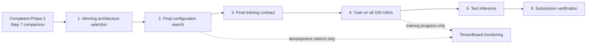

# Phase 3: Final Model Training and Inference

## Objective

Phase 3 selects the winning model architecture from the completed Phase 2
comparison, performs one final within-family configuration search, trains the
frozen model on all 100 training UAVs, and predicts the remaining useful life
(RUL) of every UAV in the test dataset. The final output is a verified
`id,RUL` file that can be uploaded to Kaggle. The external `id` values are the
internal test `uav_id` values under Kaggle's required column name.

Phase 3 answers the following questions:

- Which Phase 2 architecture best satisfies the predictive, stability, bias,
  and complexity criteria?
- Which configuration of that one architecture performs best under the fixed
  development-only tuning procedure?
- Can the selected configuration be fitted on every training UAV without
  changing any model decision after test inference is unlocked?
- Does the generated submission contain exactly one finite, nonnegative RUL
  prediction for every test UAV?

Phase 2 ends when Step 7 has produced the complete locked architecture
comparison. Architecture selection and every action after it belong to Phase 3.

## Scientific Boundary

Phase 3 is the transition from model development to final inference. Its gates
must preserve the following rules:

- Step 1 is a manual architecture decision based only on saved Phase 2
  comparison artifacts. No script automatically ranks families or declares a
  winner.
- The selected family must have completed every required Phase 2 fold and seed.
- The final search reuses the selected family's Phase 2 representation,
  feature or lookback alternatives, hyperparameter space, preprocessing rules,
  and primary metric.
- The final search uses training prefixes and development scenarios only. It
  must not load Phase 2 locked scenarios, locked predictions, or test features.
- Locked Phase 2 results support the one architecture decision in Step 1. They
  are not reopened to tune configurations or judge Phase 3 experiments.
- Test features remain inaccessible until the architecture, final
  configuration, preprocessing, training duration, and model seed are frozen.
- The test dataset has no usable target in this repository. Phase 3 never
  calculates test RMSE, R2, MAE, or bias.
- Phase 3 finishes when test predictions and the verified `submission.csv` have
  been written.

## Inputs

Phase 3 consumes saved artifacts from Phase 1 and one completed Phase 2 run.

### Phase 1 inputs

- `training_features.csv.gz`
- `development_validation_features.csv.gz`
- `test_features.csv.gz`
- `feature_catalog.csv`
- `outer_folds.csv`
- `training_prefixes.csv`
- `preprocessing_config.json`
- sequence histories and channel metadata when a sequence architecture wins
- `verification_report.json` with every leakage assertion passed

### Phase 2 inputs

- `selection_manifest.json`
- `selected_configurations.csv`
- `locked_evaluation_manifest.json`
- `comparison_manifest.json`
- `architecture_comparison.csv`
- `paired_metric_differences.csv`
- `grouped_architecture_metrics.csv`
- `seed_metrics.csv`
- `efficiency_summary.csv`
- the Phase 2 settings snapshot and model registry

Step 1 may read the consolidated Step 7 comparison tables. Later search and
training steps read the selected family and its declared model interface, but
they do not read locked predictions or locked validation features.

## Phase Entry Point and Run Identity

The entry point is:

```powershell
.\.venv\Scripts\python.exe 3_final_model_training_and_inference\run_phase_3.py
```

Phase 3 has its own settings version and run number. A Phase 3 run references a
specific Phase 2 run but never writes into its directory. Every run stores the
resolved Phase 3 settings, the referenced Phase 2 run, one manifest per step,
and a final run manifest.

The human-edited source of truth is
`1_winning_architecture_selection/phase_3_settings.toml`. Its validator is
`verify_phase_3_settings.py`; generated JSON artifacts are not edited manually.

Resume follows the existing project convention. The run number identifies the
`runs/run_<n>/` output folder, while the settings version records the revision
of the human-edited configuration. Both remain unchanged when an interrupted
run is resumed. Step 1 may be corrected before Step 2 starts. Once Step 2 has
written a status, artifact, or checkpoint, changing the TOML requires both the
settings version and run number to be advanced manually. Downstream commands
refuse to run when the current TOML differs from the resolved settings.

### Phase 3 settings contract

The Phase 3 TOML contains only decisions that belong to this phase. A Run 3
XGBoost selection, for example, is declared as:

```toml
settings_version = 1
run_number = 1
phase_2_run_number = 3
selected_model_family = "xgboost"

[final_search]
candidate_budget = 25
search_seed = 13
model_seed = 13
```

Run numbers are local to their phase directories. With the settings above,
Phase 3 reads the completed Phase 2 run from
`2_architecture_experiments/2_model_architecture_study/runs/run_3/` and writes the new Phase 3 run to
`3_final_model_training_and_inference/runs/run_1/`. The completed Phase 2
directory is referenced in place and is not renamed or modified.

The allowed values are:

- `settings_version`, `run_number`, and `phase_2_run_number`: positive integers;
- optional `phase_2_run_root`: a repository-relative Phase 2 artifact root;
  pipeline experiments generate this field so Phase 3 reads the experiment's
  own `phase2/` directory, while standalone runs omit it and use the numbered
  Phase 2 directory;
- optional `phase_2_specification`, `phase_2_model_registry`,
  `tabular_manifest`, `sequence_manifest`, and `trajectory_manifest`:
  repository-relative artifact paths used when the source is owned by a
  pipeline experiment rather than the standalone numbered Phase 2 layout;
- `selected_model_family`: a family with complete tuning, locked evaluation,
  and comparison results in the referenced Phase 2 run;
- `candidate_budget`: a positive integer, initially `25`;
- `search_seed` and `model_seed`: integers from `0` through `4294967295`,
  initially `13`.

The representation, feature sets or lookbacks, hyperparameter space,
preprocessing rules, prediction minimum, and primary metric are inherited from
the referenced Phase 2 run. They are not duplicated or overridden in the Phase
3 TOML.

The following are fixed protocol rules rather than TOML options:

- candidate generation uses Optuna `TPESampler(seed=search_seed)`;
- the configuration with the lowest mean five-fold RMSE wins;
- an exact RMSE tie is resolved by the lower candidate number;
- every candidate/fold fit and the final all-UAV fit use `model_seed`.

## Workflow



## Step 1: Winning Architecture Selection

Step 1 is the first executable Phase 3 stage. The researcher records the
winning Phase 2 family in the Phase 3 settings.

`verify_phase_3_settings.py` validates the TOML and referenced Phase 2 run
without writing files. `build_selected_architecture.py` then writes the resolved
settings as `resolved_phase_3_settings.json` and records the selection in
`selected_architecture.json`.

The selection artifact contains at least:

- `phase_2_run_number`, identifying the referenced Phase 2 source run;
- `phase_3_run_number`, identifying the active Phase 3 destination run;
- the selected family and representation;
- the inherited search-space and preprocessing identifiers;
- `locked_results_used_for_architecture_selection = true`;
- `locked_results_used_for_configuration_tuning = false`;
- `test_data_loaded = false`.

`selected_architecture.json` is generated from the validated Phase 3 settings
and must not be edited manually.

Once Step 2 starts, Step 1 is immutable. Changing the winner requires a new
Phase 3 run.

## Step 2: Final Within-Family Configuration Search

Only the selected family is tuned. Each candidate is evaluated with the fixed
five grouped UAV folds:

1. Four folds, containing 80 UAVs, provide weighted training prefixes.
2. The remaining fold, containing 20 unseen UAVs, provides the five development
   scenarios per UAV.
3. Fold-specific preprocessing is fitted on the 80 training UAVs only.
4. The candidate receives one unweighted RMSE for each validation fold.
5. Mean fold RMSE selects the configuration. R2, MAE, and bias are retained as
   diagnostics but do not alter the selection rule.

Across the five folds, all 100 training UAVs participate in validation exactly
once. No locked scenario is opened. The candidate budget and both seeds come
from the validated Phase 3 settings. The sampler, inherited search space,
selection metric, and tie-breaking rule follow the fixed contract above and
cannot be changed in place.

For models with early stopping, the best iteration from each fold is saved. The
fixed final training duration is the median of those five best iterations,
calculated without test data. Models without early stopping retain their
selected fixed training configuration.

Step 2 writes:

- `final_search_candidate_results.csv`;
- `final_search_fold_results.csv`;
- `selected_configuration.json`;
- `final_search_manifest.json`;
- development-only TensorBoard logs.

`selected_configuration.json` is generated by the declared selection rule and
must not be edited manually.

The manifest records that locked and test data were not loaded.

## Step 3: Final Training Contract

Step 3 converts the Step 1 architecture and Step 2 configuration into one
frozen training contract. It fixes:

- ordered input features or sequence channels;
- feature set or lookback;
- every hyperparameter;
- preprocessing method and fit scope;
- training rows and UAV IDs;
- sample-weighting rule;
- fixed training iterations or epochs;
- prediction minimum;
- model seed;
- model serialization format;
- expected test columns and output schema.

The `search_seed` controls candidate generation only. The `model_seed` is used
for every candidate fit and for final training on all 100 UAVs. Both seeds are
declared before Step 2 and are never selected from observed performance. The
test-data gate remains closed until the saved contract passes validation.

Step 3 writes `final_training_contract.json` and
`final_training_contract_manifest.json`.

## Step 4: Train on All Training UAVs

The final model is fitted once using all 100 training UAVs and all 2,000
training prefixes. Each UAV retains equal total influence through the existing
prefix sample weights. Preprocessing is refitted on all training UAVs because
there is no longer a held-out training fold, but the preprocessing algorithm and
feature order cannot change.

For sequence models, the saved telemetry preprocessor scales channels exactly
once. The sequence model adapter separately fits and stores the age
side-feature scaler exactly once; telemetry preprocessing never transforms
those side features.

No validation or test target is used. Early-stopped model families train for the
fixed duration inherited from Step 2 rather than inspecting another validation
set. The fitted preprocessing state and model are serialized together with a
training summary.

Step 4 writes:

- `final_model.joblib` or the selected adapter's trusted local equivalent;
- `final_preprocessor.joblib` when preprocessing is stored separately;
- `final_feature_order.json`;
- `final_training_summary.json`;
- `final_training_manifest.json`.

The gate verifies that the saved model can be reloaded and reproduce predictions
on a small training-only smoke sample before test inference is unlocked.

## Step 5: Test Inference

Step 5 is the first stage allowed to load test features. It verifies the frozen
training contract and completed Step 4 manifest before reading them.

For every test UAV, inference uses inputs derived causally through the final
available observation. Tabular winners use the final feature row in the exact
selected feature order. Sequence winners use the trailing window defined by the
exact selected lookback, channel order, padding convention, and training-fitted
scalers. Predictions are clipped only by the already declared nonnegative
minimum.

Step 5 writes `test_predictions.csv` with traceability columns and an
`inference_manifest.json`. The internal prediction table contains exactly one
row per test UAV and at least:

- `uav_id`;
- final observed cutoff;
- selected model family;
- configuration and model identifiers;
- model seed;
- predicted RUL.

No test metric is calculated and no alternative model is run after predictions
are inspected.

## Step 6: Submission Verification

Step 6 creates the Kaggle upload file from the validated internal prediction
table. The submission must:

- contain exactly the columns `id` and `RUL`;
- copy each internal `uav_id` value unchanged into the external `id` column;
- contain exactly one row for every unique test UAV;
- contain no training UAV and no unknown UAV identifier;
- preserve the exact test UAV identifier set;
- contain finite numeric RUL values at or above zero;
- contain no index column or extra metadata;
- use a deterministic row order;
- reproduce identically when regenerated from the saved final model and passed
  through the same canonical CSV serialization boundary.

The stage writes `submission.csv`, `submission_manifest.json`, and a final Phase
3 run manifest listing the completed outputs. A Kaggle score, if later
available, is recorded separately and never written back into the training
contract.

## Step 7: Post-Run Reporting

After Step 6 completes, the Phase 3 runner automatically invokes
`build_phase_3_report.py` to create a model-agnostic report from the common
candidate, fold, timing, TensorBoard, and prediction artifacts. The same
implementation applies to every registered model family; it does not branch
into XGBoost-, neural-, or baseline-specific reporting contracts.

The report contains:

- final-search progression and the running best RMSE;
- top-candidate fold robustness and an all-candidate fold heatmap;
- the selected configuration's RMSE, MAE, R2, and bias across folds;
- feature-set, lookback, or fixed-input candidate comparisons;
- candidate performance against training cost;
- the final all-UAV training curve when a shared `train/loss` scalar exists;
- descriptive test-prediction distribution and cutoff views.

A model without an iterative loss curve still receives every applicable plot;
the unavailable curve is recorded as skipped. Reporting never loads locked
data or test targets, calculates test metrics, refits a candidate, changes the
selection, or modifies the final model and submission. Step 7 is part of the
default execution path but does not add another scientific decision gate. A
reporting failure does not invalidate the verified model or submission and may
be resumed independently with `run_phase_3.py --from-step 7`.
After successful reporting, the final run manifest records the Step 7 manifest
and report-summary path.

## Directory Layout

The artifact paths below are relative to
`3_final_model_training_and_inference/runs/run_<n>/`. The implementation folders
with the same step names contain the scripts, while the run folder contains
settings, manifests, checkpoints, logs, and generated artifacts.

| Step folder | Python script | Main artifact | Script task |
| --- | --- | --- | --- |
| Phase root | `run_phase_3.py`, `launch_tensorboard.py`, `verify_phase_3_implementation.py` | `final_run_manifest.json` | Run and resume all seven steps, launch run-local monitoring, and verify the implementation without loading locked or test data. |
| `1_winning_architecture_selection/` | `verify_phase_3_settings.py`, `build_selected_architecture.py` | `artifacts/selected_architecture.json` | Validate the Phase 3 TOML and chosen family against the referenced completed Phase 2 run, then write the immutable selection artifact. |
| `2_final_configuration_search/` | `run_final_configuration_search.py` | `artifacts/selected_configuration.json` | Search only the selected family on the five development folds and save the configuration chosen by mean fold RMSE. |
| `3_final_training_contract/` | `build_final_training_contract.py` | `artifacts/final_training_contract.json` | Combine the selected architecture and configuration into the validated contract that freezes every final-training decision. |
| `4_final_model_training/` | `run_final_model_training.py` | `artifacts/final_model.joblib` | Fit the contracted model and preprocessing on all 100 training UAVs, serialize it through the selected adapter, and verify model reload. |
| `5_test_inference/` | `run_test_inference.py` | `artifacts/test_predictions.csv` | Load test features for the first time and produce one traceable prediction per test UAV with the frozen model. |
| `6_submission_verification/` | `build_submission.py` | `artifacts/submission.csv` | Create the two-column Kaggle submission and verify its identifiers, values, order, and reproducibility. |
| `7_post_run_reporting/` | `build_phase_3_report.py`, `verify_phase_3_reporting.py` | `figures/*.png` | Automatically create and verify model-agnostic search, stability, efficiency, training, and target-free prediction figures after Step 6. |

## Resume and Failure Rules

- Steps run in order and later gates require complete predecessor manifests.
- Completed candidate evaluations are preserved when the same settings version
  and run number are resumed.
- An interrupted candidate or final fit is marked `interrupted`, never left as
  `running` indefinitely.
- `--force` deliberately replaces completed expensive work and should be used
  only when a complete rerun is intended.
- Forcing an upstream step invalidates every downstream completion manifest so
  an older contract, model, prediction table, or submission cannot pass a gate.
- Test inference may be regenerated from the saved final model.
- Submission generation is inexpensive and may be repeated from an identical
  saved model and prediction table.
- Reporting is regenerated automatically when Step 7 is included and can be
  rerun independently without refitting or repeating test inference.

## Verification Strategy

Before real test inference, run the training/development-only implementation
checks:

```powershell
.\.venv\Scripts\python.exe 3_final_model_training_and_inference\verify_phase_3_implementation.py
```

The checks cover:

- schema and settings validation tests;
- grouped-fold and preprocessing-isolation tests;
- proof that Step 2 cannot open locked or test paths;
- proof that Steps 1-4 report `test_data_loaded = false`;
- selected-configuration and fixed-duration tests;
- model save/reload prediction-equivalence tests;
- synthetic test-inference tests using an in-memory dataset and model adapter;
- submission row-count, identifier, finiteness, and determinism tests;
- interruption and resume tests.

These checks exercise pipeline behavior without creating another Phase 2
architecture-comparison run.

## Completion Criteria

Phase 3 is complete when:

- the winning Phase 2 architecture is recorded in Step 1;
- the final configuration is selected using development scenarios only;
- the complete training contract is frozen before test features are loaded;
- the final model is fitted on all 100 training UAVs and reload verification
  passes;
- exactly one nonnegative finite prediction exists for every test UAV;
- `submission.csv` passes every schema and identifier check;
- the model-agnostic Step 7 report and applicable figures are generated;
- the final manifest records the selected settings, configuration, model,
  prediction table, submission, and report paths;
- no locked result, test prediction, or Kaggle score has been used for another
  tuning decision.

## Current Implementation Status

The seven-step Phase 3 workflow is implemented. The tracked TOML selects
XGBoost from completed Phase 2 Run 3 and declares the active Phase 3 run
number. Implementation verification does not start the expensive candidate
search. Running `run_phase_3.py` starts or resumes the active workflow and
generates the report after Step 6, while `--status` is read-only.
